# 🔄 İş Akışları — Öğretmen · Öğrenci · Veli (A'dan Z'ye)

> ⚠️ **ARŞİV (2026-08-19):** Bu doküman tarihîdir. Geçerli otorite `doc/roles/` + `doc/modules/`'tedir. Buradaki bilgi yalnızca geçmiş referans içindir; çelişkide roles/modules esastır. Bu dokümandaki akış-boşluğu listeleri güncel değildir; teknik açık/durum için [`../modules/mimari_inceleme.md`](../modules/mimari_inceleme.md) esastır.

> **Bu dokümanın amacı:** Platformdaki her rolün **uçtan uca iş akışını** adım adım, diyagramlarla ve
> **koddan doğrulanmış** olarak anlatmak. "Hangi rol ne yapıyor, hangi ekrandan, hangi endpoint'e, hangi kuralla,
> sonrasında hangi event tetikleniyor" sorusunun tek adresi.
>
> **Diğer dokümanlardan farkı:**
> - [`roles/`](../roles/00_roller_genel_bakis.md) → rolün **yetenek listesi ve ürün perspektifi** (ne yapabilir).
> - [`modules/`](../modules/00_genel_bakis.md) → modülün **teknik iç yapısı** (domain, API, kural).
> - **Bu doküman** → ikisini birleştiren **akış (workflow) perspektifi**: adım sırası, durum geçişleri, modüller arası zincir.
>
> **Doğruluk kaynağı = KOD.** Aşağıdaki her akış `src/` ve `mobile/lib/` içinden doğrulanmıştır. PRD'de vaat edilen
> ama kodda karşılığı olmayan adımlar 🔴 ile açıkça işaretlenmiştir — **planlanan ile mevcut karıştırılmamıştır.**
>
> **Güncelleme:** 2026-07-18

---

## 0. Okuma kılavuzu

### 0.1 Durum işaretleri

| İşaret | Anlamı |
|:------:|--------|
| 🟢 | **Uçtan uca çalışıyor** — API + domain kuralı + mobil ekran mevcut |
| 🟡 | **Kısmi** — bir katman eksik (ör. API var / ekran yok, ya da domain metodu var / endpoint yok) |
| 🔴 | **Yok** — yalnızca PRD/doküman vaadi; kodda karşılığı yok |
| ⚠️ | **Kod-gerçeği uyarısı** — kodun davranışı, tasarım niyetinden sapıyor |

### 0.2 Akışları okurken bilinmesi gereken 3 mimari gerçek

1. **HTTP katmanında rol kontrolü yoktur.** Tüm endpoint'ler yalnızca `RequireAuthorization("AuthenticatedUser")` der
   (`src/API.Host/Program.cs:95`). Rol/sahiplik kararı **Application katmanındaki `ICommandAuthorizer`/`IQueryAuthorizer`**
   sınıflarında verilir. Aşağıdaki tablolarda yazan roller bu authorizer'lardan okunmuştur, endpoint attribute'undan değil.
2. **Varsayılan-deny zorunludur.** Authorizer'ı olmayan bir handler uygulamayı **başlangıçta çökertir**
   (`AuthorizationCoverageValidator.cs:52-64`). Yani "yetki kontrolü unutuldu" durumu mimari olarak imkânsız.
3. **Her domain event otomatik integration event olur.** `SaveChanges` anında, aynı transaction içinde
   `outbox_messages` tablosuna yazılır (`ModuleDbContext.cs:63-91`) ve `JsonDomainEventMapper` ile
   `Name = C# sınıf adı` olacak şekilde yayınlanır. Modüller birbirini **string event adıyla** dinler,
   proje referansıyla değil.

---

## 1. Sistem haritası — kim, hangi modülü kullanıyor?

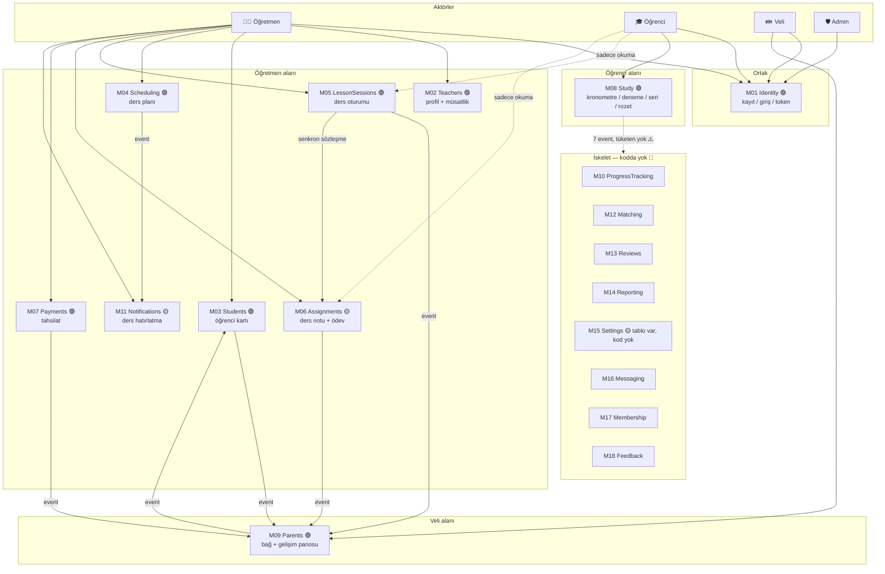
```mermaid
graph TB
    subgraph Aktorler["Aktörler"]
        T["👨‍🏫 Öğretmen"]
        S["🎓 Öğrenci"]
        V["👪 Veli"]
        A["🛡️ Admin"]
    end

    subgraph Ortak["Ortak"]
        M01["M01 Identity 🟢<br/>kayıt / giriş / token"]
    end

    subgraph OgretmenAlani["Öğretmen alanı"]
        M02["M02 Teachers 🟢<br/>profil + müsaitlik"]
        M03["M03 Students 🟢<br/>öğrenci kartı"]
        M04["M04 Scheduling 🟢<br/>ders planı"]
        M05["M05 LessonSessions 🟢<br/>ders oturumu"]
        M06["M06 Assignments 🟡<br/>ders notu + ödev"]
        M07["M07 Payments 🟢<br/>tahsilat"]
        M11["M11 Notifications 🟡<br/>ders hatırlatma"]
    end

    subgraph OgrenciAlani["Öğrenci alanı"]
        M08["M08 Study 🟢<br/>kronometre / deneme / seri / rozet"]
    end

    subgraph VeliAlani["Veli alanı"]
        M09["M09 Parents 🟢<br/>bağ + gelişim panosu"]
    end

    subgraph Iskelet["İskelet — kodda yok 🔴"]
        M10["M10 ProgressTracking"]
        M12["M12 Matching"]
        M13["M13 Reviews"]
        M14["M14 Reporting"]
        M15["M15 Settings 🟡 tablo var, kod yok"]
        M16["M16 Messaging"]
        M17["M17 Membership"]
        M18["M18 Feedback"]
    end

    T --> M01 & M02 & M03 & M04 & M05 & M06 & M07 & M11
    S --> M01 & M08
    S -.->|"sadece okuma"| M05 & M06
    V --> M01 & M09
    A --> M01

    M05 -->|event| M09
    M06 -->|event| M09
    M07 -->|event| M09
    M03 -->|event| M09
    M09 -->|event| M03
    M04 -->|event| M11
    M05 -->|senkron sözleşme| M06
    M08 -.->|"7 event, tüketen yok ⚠️"| Iskelet
```

**Haritanın anlattığı en önemli üç şey:**
- **Öğretmen alanı** platformun olgun kısmıdır — 7 modül uçtan uca çalışır.
- **Öğrenci alanı (M08 Study) tamamen izoledir.** Öğrencinin çalışma verisi hiçbir modüle akmaz; 7 event'inin de
  tüketicisi yoktur. Yani "öğrenci 100 saat çalıştı" bilgisi veliye/öğretmene **hiç ulaşmaz**.
- **Veli alanı yalnızca kendi read-model'inden beslenir.** Veli, öğretmen modüllerinin API'lerine hiç dokunmaz;
  Parents modülü event'lerle kendi `ChildProgressSnapshot` tablosunu doldurur, veli oradan okur.

---

## 2. Ortak omurga — bir istek baştan sona ne yaşıyor?

Aşağıdaki akış **her endpoint için aynıdır**; sonraki bölümlerde tekrar edilmeyecek.

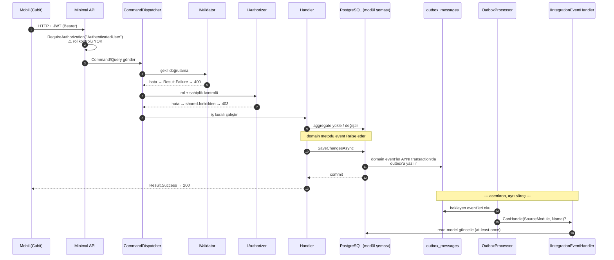
```mermaid
sequenceDiagram
    autonumber
    participant UI as Mobil (Cubit)
    participant API as Minimal API
    participant D as CommandDispatcher
    participant Val as IValidator
    participant Auth as IAuthorizer
    participant H as Handler
    participant DB as PostgreSQL (modül şeması)
    participant OB as outbox_messages
    participant P as OutboxProcessor
    participant EH as IIntegrationEventHandler

    UI->>API: HTTP + JWT (Bearer)
    API->>API: RequireAuthorization("AuthenticatedUser")<br/>⚠️ rol kontrolü YOK
    API->>D: Command/Query gönder
    D->>Val: şekil doğrulama
    Val-->>D: hata → Result.Failure → 400
    D->>Auth: rol + sahiplik kontrolü
    Auth-->>D: hata → shared.forbidden → 403
    D->>H: iş kuralı çalıştır
    H->>DB: aggregate yükle / değiştir
    Note over H,DB: domain metodu event Raise eder
    H->>DB: SaveChangesAsync
    DB->>OB: domain event'ler AYNI transaction'da<br/>outbox'a yazılır
    DB-->>H: commit
    H-->>UI: Result.Success → 200
    Note over OB,EH: --- asenkron, ayrı süreç ---
    P->>OB: bekleyen event'leri oku
    P->>EH: CanHandle(SourceModule, Name)?
    EH->>DB: read-model güncelle (at-least-once)
```

**Kritik davranışlar:**
- **Atomiklik:** İş verisi ile event aynı transaction'da yazılır → "kayıt oldu ama event kayboldu" imkânsız.
- **En-az-bir-kez teslim:** Aynı event birden çok kez işlenebilir. Parents modülü bunu `ProcessedIntegrationEvent`
  tablosuyla engeller (`ParentReadModelProjections.cs:41-55`); diğer handler'lar "kayıt zaten var mı" kontrolüyle korunur.
- **Sunucu-taraflı filtre zorlama (K2 deseni):** Liste sorgularında istemcinin gönderdiği filtre **güvenilmez kabul edilir**.
  Admin değilse handler filtreyi ezer: öğretmense `teacherUserId = currentUser`, değilse `studentId = currentUser`
  (`LessonSessionFeatures.cs:67-93`, `AssignmentFeatures.cs:78-103`).

---

## 3. Ortak akış — Kayıt, rol seçimi, ilk profil

Bu akış **üç rol için de aynı kapıdan** geçer, sonra ayrışır.

### 3.1 Uçtan uca kayıt akışı

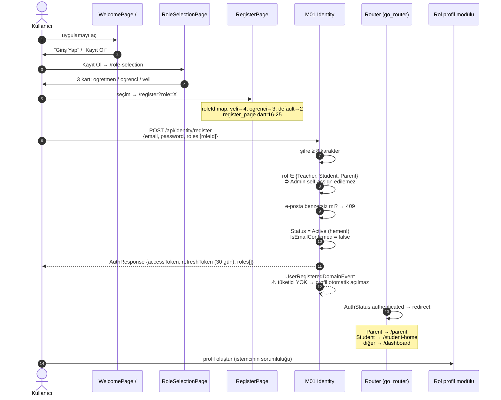
```mermaid
sequenceDiagram
    autonumber
    actor U as Kullanıcı
    participant W as WelcomePage /
    participant RS as RoleSelectionPage
    participant R as RegisterPage
    participant ID as M01 Identity
    participant RT as Router (go_router)
    participant P as Rol profil modülü

    U->>W: uygulamayı aç
    W->>U: "Giriş Yap" / "Kayıt Ol"
    U->>RS: Kayıt Ol → /role-selection
    RS->>U: 3 kart: ogretmen / ogrenci / veli
    U->>R: seçim → /register?role=X
    Note over R: roleId map: veli→4, ogrenci→3, default→2<br/>register_page.dart:16-25
    U->>ID: POST /api/identity/register<br/>{email, password, roles:[roleId]}
    ID->>ID: şifre ≥ 8 karakter
    ID->>ID: rol ∈ {Teacher, Student, Parent}<br/>⛔ Admin self-assign edilemez
    ID->>ID: e-posta benzersiz mi? → 409
    ID->>ID: Status = Active (hemen!)<br/>IsEmailConfirmed = false
    ID-->>U: AuthResponse {accessToken, refreshToken (30 gün), roles[]}
    ID--)ID: UserRegisteredDomainEvent<br/>⚠️ tüketici YOK → profil otomatik açılmaz
    RT->>RT: AuthStatus.authenticated → redirect
    Note over RT: Parent → /parent<br/>Student → /student-home<br/>diğer → /dashboard
    U->>P: profil oluştur (istemcinin sorumluluğu)
```

### 3.2 Rol → ilk profil eşlemesi

| Rol | Yönlendirilen ana ekran | İlk profil çağrısı | Kim tetikler |
|-----|------------------------|--------------------|--------------|
| 👨‍🏫 Öğretmen | `/dashboard` | `POST /api/teachers/profiles` | Kullanıcı, profil ekranından **elle** |
| 🎓 Öğrenci | `/student-home` | `POST /api/students/profiles` `{Origin: SelfRegistered}` | **Otomatik** — `StudyHomeCubit._resolveStudentId` (`study_home_cubit.dart:52-63`) profil yoksa `gradeLevel:'Belirtilmedi'` ile oluşturur |
| 👪 Veli | `/parent` | `POST /api/parents/profiles` | **Otomatik** — `ensureProfile` (`parent_repository_impl.dart:37`); handler idempotent, tekrar çağrı güvenli |

### 3.3 Router yönlendirme mantığı (`app_router.dart:46-114`)

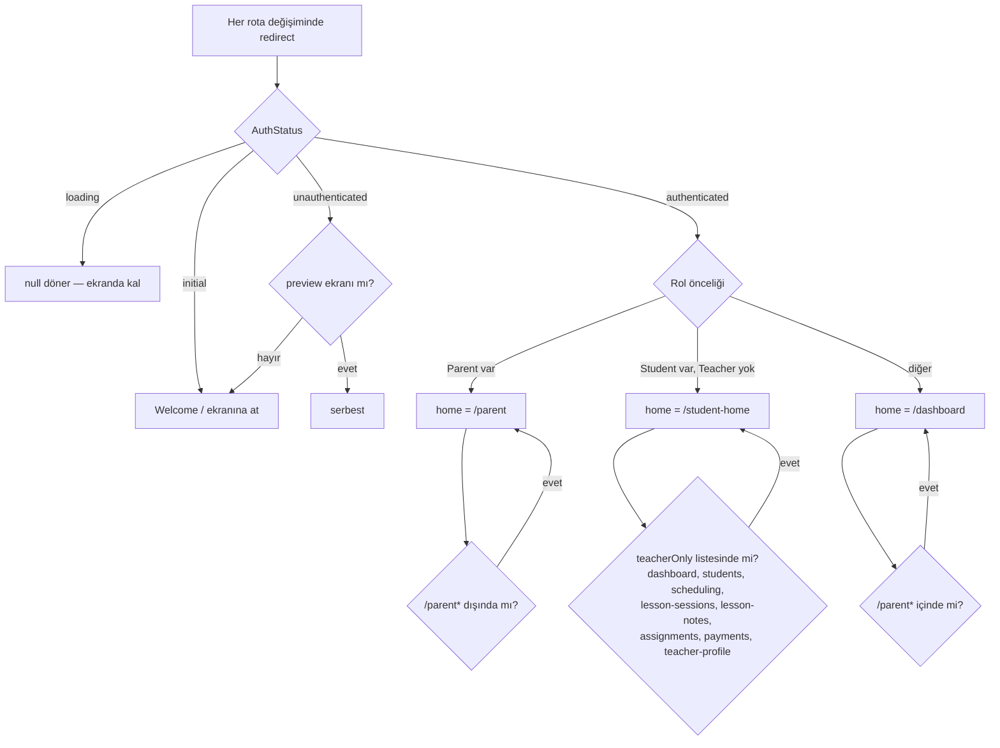
```mermaid
flowchart TD
    A[Her rota değişiminde redirect] --> B{AuthStatus}
    B -->|loading| C[null döner — ekranda kal]
    B -->|initial| D["Welcome / ekranına at"]
    B -->|unauthenticated| E{preview ekranı mı?}
    E -->|evet| F[serbest]
    E -->|hayır| D
    B -->|authenticated| G{"Rol önceliği"}
    G -->|"Parent var"| H["home = /parent"]
    G -->|"Student var, Teacher yok"| I["home = /student-home"]
    G -->|"diğer"| J["home = /dashboard"]
    H --> K{"/parent* dışında mı?"}
    K -->|evet| H
    I --> L{"teacherOnly listesinde mi?<br/>dashboard, students, scheduling,<br/>lesson-sessions, lesson-notes,<br/>assignments, payments, teacher-profile"}
    L -->|evet| I
    J --> M{"/parent* içinde mi?"}
    M -->|evet| J
```

> ⚠️ **Rol önceliği: Parent > Student > Teacher.** Hem `Student` hem `Teacher` rolü olan kullanıcı **öğretmen** sayılır
> ve öğrenci ekranlarına erişemez.
>
> ⚠️ **Guard boşluğu:** `teacherOnly` listesinde `/more`, `/account-info`, `/notifications` **yok**. Öğrenci `/more`'a
> girebilir ve orada **öğretmenin alt menüsünü** görür (`more_page.dart:51`); sekmeye basınca guard onu geri atar.
> `student_home_page.dart:46` zaten ayarlar için `/more`'a push ediyor.

### 3.4 Oturum yaşam döngüsü

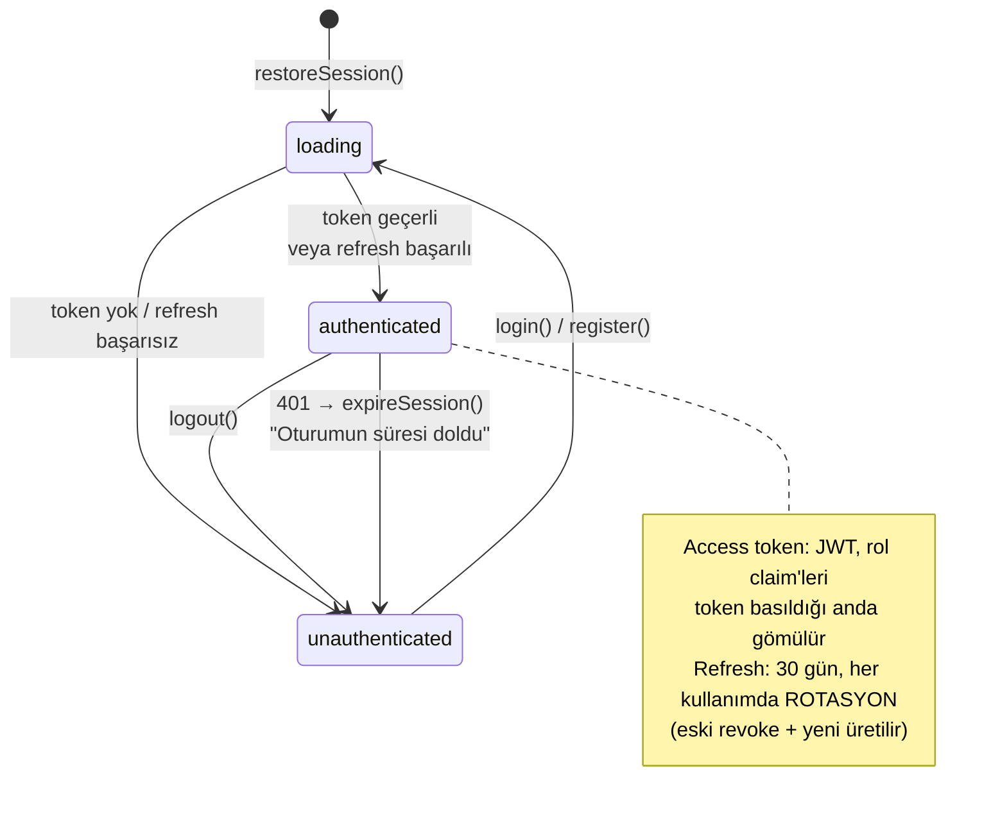
```mermaid
stateDiagram-v2
    [*] --> loading: restoreSession()
    loading --> authenticated: token geçerli<br/>veya refresh başarılı
    loading --> unauthenticated: token yok / refresh başarısız
    unauthenticated --> loading: login() / register()
    authenticated --> unauthenticated: logout()
    authenticated --> unauthenticated: 401 → expireSession()<br/>"Oturumun süresi doldu"
    note right of authenticated
        Access token: JWT, rol claim'leri
        token basıldığı anda gömülür
        Refresh: 30 gün, her kullanımda ROTASYON
        (eski revoke + yeni üretilir)
    end note
```

**⚠️ Rol claim'i token'a gömülüdür.** Admin bir kullanıcıya `POST /users/{id}/roles` ile yeni rol verse bile,
kullanıcı **yeniden login/refresh yapmadan** yeni rolü kullanamaz.

### 3.5 Kimlik akışındaki kod-gerçeği uyarıları

| # | Bulgu | Kanıt |
|---|-------|-------|
| 1 | **E-posta doğrulama zorunlu değil.** Kullanıcı `Active` doğar, doğrulamadan her işlemi yapar | `IdentityFeatures.cs:67` |
| 2 | **Doğrulama e-postası fiilen gönderilmiyor** — `NullIdentityNotificationService` | `IdentityRepositoryAndSecurity.cs:132-136` |
| 3 | **Şifremi unuttum ekranı yok** — API var (`/password-reset/request`), mobil SnackBar diyor: *"henüz eklenmedi"* | `login_page.dart:271-291` |
| 4 | **"Giriş Yap" linkleri her zaman `?role=ogretmen`** — veli/öğrenci mock girişi için URL elle değiştirilmeli | `welcome_page.dart:29`, `role_selection_page.dart:77` |
| 5 | **`roleId` gerçek login body'sine gitmiyor** — sadece mock modda etkili; gerçek roller yanıttan gelir | `auth_repository_impl.dart:46-53` |
| 6 | **Form alanları test credential'ıyla dolu geliyor** (`teacher1@example.com` / `Teacher123!`) | `login_page.dart:24-25` |
| 7 | **"Beni hatırla" ölü UI** — state hiç okunmuyor | `login_page.dart:246-255` |
| 8 | **Rol silme yolu yok** — `AssignRoles` yalnızca ekler | `IdentityFeatures.cs:247-251` |
| 9 | **`UserAccountStatus` geçişi yok** — `Suspended`/`Closed` yalnızca DB'den elle set edilebilir | `IdentityDomainModel.cs:198` |

**Güvenlik tarafında doğru yapılanlar:** login throttle (5 hata / 15 dk, Redis), generic `invalid_credentials`
(kullanıcı enumeration engeli), şifre sıfırlamada kullanıcı yoksa bile `Success` dönme, refresh rotasyonu,
şifre değişince **tüm oturumların revoke** edilmesi, logout'ta access token'ın `jti` ile blacklist'e alınması.

---

## 4. 👨‍🏫 ÖĞRETMEN — A'dan Z'ye

Platformun **en olgun rolü**. Takvim-merkezli bir yönetim aracı: öğrenci ekle → ders planla → dersi işle →
not/ödev yaz → parayı takip et.

### 4.1 Öğretmenin tam iş akışı

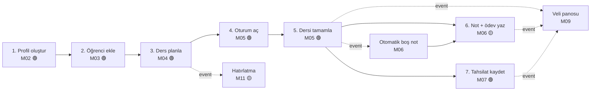
```mermaid
flowchart LR
    A["1. Profil oluştur<br/>M02 🟢"] --> B["2. Öğrenci ekle<br/>M03 🟢"]
    B --> C["3. Ders planla<br/>M04 🟢"]
    C --> D["4. Oturum aç<br/>M05 🟢"]
    D --> E["5. Dersi tamamla<br/>M05 🟢"]
    E --> F["6. Not + ödev yaz<br/>M06 🟡"]
    E --> G["7. Tahsilat kaydet<br/>M07 🟢"]
    C -.->|event| H["Hatırlatma<br/>M11 🟡"]
    E -.->|event| I["Otomatik boş not<br/>M06"]
    I --> F
    E -.->|event| J["Veli panosu<br/>M09"]
    F -.->|event| J
    G -.->|event| J
```

### 4.2 Adım 1 — Öğretmen profili 🟢

| Adım | Ekran | Endpoint | Yetki |
|------|-------|----------|-------|
| Profil oluştur | `/teacher-profile` | `POST /api/teachers/profiles` | Admin **veya** Teacher && `body.UserId == self` |
| Profil güncelle | `/teacher-profile` | `PUT /api/teachers/profiles/{userId}` | Admin **veya** Teacher && `route.userId == self` |
| Profil görüntüle | — | `GET /api/teachers/profiles/{userId}` | **Herhangi bir giriş yapmış kullanıcı** |

**Profil içeriği:** ad, branş, şehir/ilçe, biyografi, başlık, ders formatı (`InPerson`/`Online`/`Hybrid`),
deneyim yılı, eğitim seviyesi, saatlik ücret + para birimi, fotoğraf, **haftalık müsaitlik slotları**.

**İş kuralları:**
- Kullanıcı başına **tek profil** — ikinci `POST` → `409 teachers.profile_exists`
- Her slot için `EndTime > StartTime` → değilse `teachers.invalid_availability`
- `PUT`'ta slotlar **tamamen değiştirilir** (`Clear()` + `AddRange`) — kısmi güncelleme yok
- `PUT`'ta `body.UserId` **yok sayılır**, route'taki `userId` esastır (spoofing engeli)

> ⚠️ **`IsVerified` hiçbir zaman `true` olamaz.** Create'te sabit `false` yazılır (`TeacherProfileFeatures.cs:138`),
> `Update` metodu bu alanı **parametre olarak almaz**. Endpoint özeti "doğrulama bilgilerini günceller" dese de
> (`TeachersModule.cs:56`) kodda karşılığı yoktur. **Öğretmen doğrulama akışı 🔴 uygulanmamış.**
>
> ⚠️ **Müsaitlik slotları arasında çakışma kontrolü yok** — yalnızca slot içi `End > Start` kontrol edilir.
> Aynı güne 09:00-12:00 ve 10:00-11:00 birlikte girilebilir.

### 4.3 Adım 2 — Öğrenci ekleme 🟢

Platformun en kritik ayrımlarından biri: **öğrencinin Identity hesabı olmak zorunda değildir.**

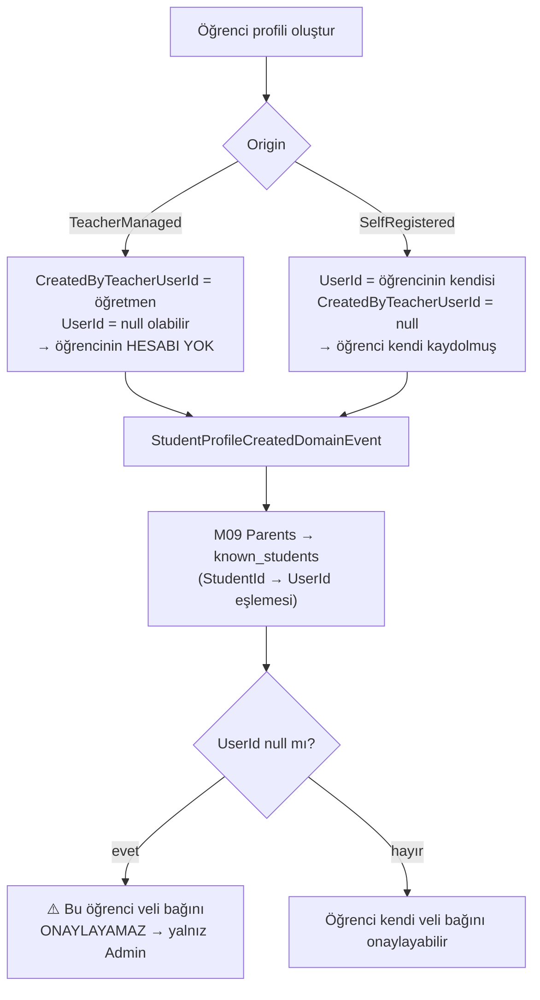
```mermaid
flowchart TD
    A[Öğrenci profili oluştur] --> B{Origin}
    B -->|TeacherManaged| C["CreatedByTeacherUserId = öğretmen<br/>UserId = null olabilir<br/>→ öğrencinin HESABI YOK"]
    B -->|SelfRegistered| D["UserId = öğrencinin kendisi<br/>CreatedByTeacherUserId = null<br/>→ öğrenci kendi kaydolmuş"]
    C --> E[StudentProfileCreatedDomainEvent]
    D --> E
    E --> F["M09 Parents → known_students<br/>(StudentId → UserId eşlemesi)"]
    F --> G{UserId null mı?}
    G -->|evet| H["⚠️ Bu öğrenci veli bağını<br/>ONAYLAYAMAZ → yalnız Admin"]
    G -->|hayır| I["Öğrenci kendi veli bağını onaylayabilir"]
```

| Adım | Endpoint | Yetki |
|------|----------|-------|
| Öğrenci ekle | `POST /api/students/profiles` | Admin **veya** (`TeacherManaged` + Teacher + self) **veya** (`SelfRegistered` + Student + self) |
| Öğrencilerimi listele | `GET /api/students/profiles/by-teacher/{teacherUserId}` | Admin **veya** Teacher && self |
| Öğrenci detayı | `GET /api/students/profiles/{studentId}` | Admin **veya** `UserId` / `CreatedByTeacherUserId` / **`ParentUserId`** == self |
| Öğrenci güncelle | `PUT /api/students/profiles/{studentId}` | Admin **veya** Teacher && `CreatedByTeacherUserId == self` |

**Origin invariant'ları** (`StudentProfileFeatures.cs:100-108`):
- `TeacherManaged` ise `CreatedByTeacherUserId` **zorunlu**
- `SelfRegistered` ise `UserId` **zorunlu**
- `Origin` **değiştirilemez** — profil doğduğu gibi kalır
- `UserId` verilmişse ve o kullanıcının profili varsa → `409 students.user_profile_exists`

**Silme yok, pasifleştirme var:** `IsActive: true ⇄ false` (`Update` üzerinden). Hard delete yoktur.

> ⚠️ **Öğretmen yalnızca KENDİ eklediği öğrencileri listeler.** Filtre `CreatedByTeacherUserId == teacherUserId`
> (`StudentProfileRepository.cs:41`). Ders verdiği ama **başkasının eklediği** öğrenci bu listede görünmez.
>
> ⚠️ **Kendi kaydolan öğrenci kendi profilini güncelleyemez** — `UpdateStudentProfileCommandAuthorizer` yalnızca
> Admin ve oluşturan öğretmeni kabul eder; `SelfRegistered` öğrencinin `CreatedByTeacherUserId`'si null olduğu için
> hiçbir dala düşmez (`StudentProfilePolicies.cs:96-114`). **Muhtemel ürün açığı.**
>
> ⚠️ **Veli, çocuğu için öğrenci profili oluşturamaz.** `ParentUserId` istek gövdesinde taşınır ama authorizer'ın
> hiçbir dalı `Parent` rolünü kabul etmez.

### 4.4 Adım 3 — Ders planlama (M04 Scheduling) 🟢

| Adım | Ekran | Endpoint | Yetki |
|------|-------|----------|-------|
| Ders planla | `/scheduling` | `POST /api/scheduling/lessons` | Admin **veya** Teacher && self |
| Ders güncelle | `/scheduling` | `PUT /api/scheduling/lessons/{id}` | Admin **veya** dersin sahibi |
| Ders iptal | `/scheduling` | `POST /api/scheduling/lessons/{id}/cancel` | Admin **veya** dersin sahibi |
| Ders tamamla | `/scheduling` | `POST /api/scheduling/lessons/{id}/complete` | Admin **veya** dersin sahibi |
| Takvim | `/scheduling` | `GET /api/scheduling/teachers/{id}/lessons?startAtUtc&endAtUtc` | Admin **veya** Teacher && self |

#### Ders planı durum makinesi

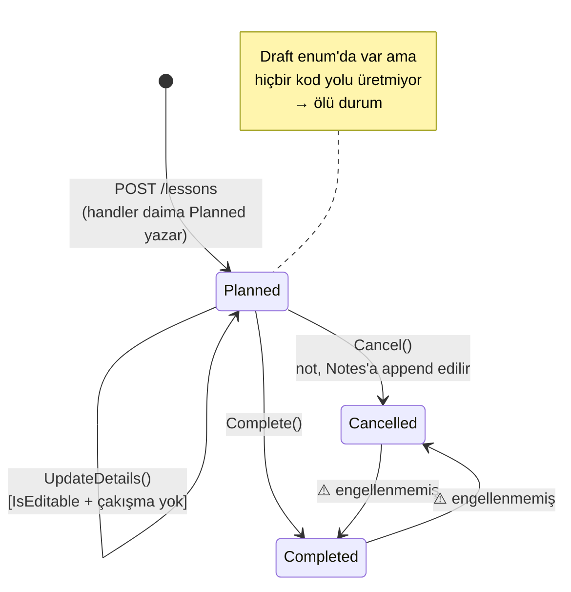
```mermaid
stateDiagram-v2
    [*] --> Planned: POST /lessons<br/>(handler daima Planned yazar)
    Planned --> Planned: UpdateDetails()<br/>[IsEditable + çakışma yok]
    Planned --> Cancelled: Cancel()<br/>not, Notes'a append edilir
    Planned --> Completed: Complete()

    Cancelled --> Completed: ⚠️ engellenmemiş
    Completed --> Cancelled: ⚠️ engellenmemiş

    note left of Planned
        Draft enum'da var ama
        hiçbir kod yolu üretmiyor
        → ölü durum
    end note
```

**Çakışma kontrolü** (`LessonScheduleRepository.cs:21-30`) — planlamanın tek gerçek koruması:
```
TeacherUserId eşit
AND Status != Cancelled          ← iptal edilen ders çakışma yaratmaz
AND Id != excludeLessonId        ← güncellemede kendini hariç tut
AND StartAtUtc < endAtUtc AND EndAtUtc > startAtUtc
```

> ⚠️ **Öğrenci çakışması kontrol EDİLMİYOR.** Aynı öğrenci, aynı saatte iki farklı öğretmene yazılabilir.
> Kontrol yalnızca `TeacherUserId` üzerindedir.
>
> ⚠️ **Tekrarlayan ders motoru yok.** `RecurrenceRule` yalnızca `.Trim()` edilip saklanan **serbest metin**dir;
> hiçbir yerde parse edilmez, occurrence üretilmez, çakışma kontrolü tekrarları görmez. **Veri alanı var, motor yok.**
>
> ⚠️ **İptal politikası yok** — zaman penceresi, ceza, ücret iadesi hiçbiri kodda yoktur. İptal = not append + event.
>
> ⚠️ **Öğrenci ve veli Scheduling'e HİÇ erişemez** — `GET /lessons/{id}` dahil tüm uçlar Admin/Teacher'a kapalıdır
> (`LessonSchedulePolicies.cs:98-108`). Öğrenci ders planını göremez.

#### Hatırlatma zinciri (M11 Notifications) 🟡

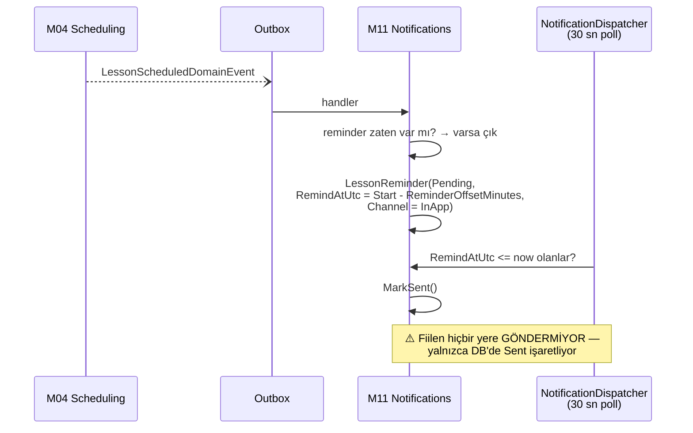
```mermaid
sequenceDiagram
    participant SCH as M04 Scheduling
    participant OB as Outbox
    participant NOT as M11 Notifications
    participant BG as NotificationDispatcher<br/>(30 sn poll)

    SCH--)OB: LessonScheduledDomainEvent
    OB->>NOT: handler
    NOT->>NOT: reminder zaten var mı? → varsa çık
    NOT->>NOT: LessonReminder(Pending,<br/>RemindAtUtc = Start - ReminderOffsetMinutes,<br/>Channel = InApp)
    BG->>NOT: RemindAtUtc <= now olanlar?
    NOT->>NOT: MarkSent()
    Note over BG,NOT: ⚠️ Fiilen hiçbir yere GÖNDERMİYOR —<br/>yalnızca DB'de Sent işaretliyor
```

> 🔴 **Erteleme boşluğu — en kritik bulgulardan biri:** Ders saati değiştiğinde
> `LessonScheduleRescheduledDomainEvent` yayılır ama **tüketicisi yoktur**. Notifications handler'ı yalnızca
> `LessonScheduledDomainEvent` ve `LessonScheduleCancelledDomainEvent` dinler
> (`LessonScheduleNotificationIntegrationEventHandler.cs:29-32`) ve zaten "reminder varsa çık" der.
> **Sonuç: Ders ertelenince hatırlatma eski saatte kalır.**

### 4.5 Adım 4-5 — Ders oturumu (M05 LessonSessions) 🟢

| Adım | Endpoint | Yetki |
|------|----------|-------|
| Oturum aç | `POST /api/lesson-sessions` | Admin **veya** Teacher && self |
| Oturumu tamamla | `POST /api/lesson-sessions/{id}/complete` | Admin **veya** oturumun öğretmeni |
| Oturum detayı | `GET /api/lesson-sessions/{id}` | Admin **veya** öğretmeni **veya 🎓 öğrencisi** |
| Oturum listesi | `GET /api/lesson-sessions?...` | Giriş yapmış; **filtre sunucuda ezilir** |

#### Ders oturumu durum makinesi

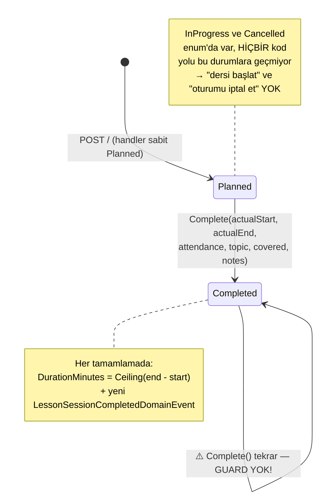
```mermaid
stateDiagram-v2
    [*] --> Planned: POST / (handler sabit Planned)
    Planned --> Completed: Complete(actualStart, actualEnd,<br/>attendance, topic, covered, notes)
    Completed --> Completed: ⚠️ Complete() tekrar — GUARD YOK!

    note right of Completed
        Her tamamlamada:
        DurationMinutes = Ceiling(end - start)
        + yeni LessonSessionCompletedDomainEvent
    end note

    note left of Planned
        InProgress ve Cancelled
        enum'da var, HİÇBİR kod
        yolu bu durumlara geçmiyor
        → "dersi başlat" ve "oturumu iptal et" YOK
    end note
```

**Yoklama durumu** ayrı bir alandır: `StudentAttendanceStatus = Unknown | Attended | Late | Absent`.

> 🔴 **En ciddi veri bütünlüğü açığı:** `LessonSession.Complete()` **hiçbir durum kontrolü yapmaz**
> (`LessonSessionsDomainModel.cs:79-99`), handler'da da guard yoktur. Tamamlanmış bir oturum tekrar tamamlanabilir
> ve **her çağrıda yeni bir `LessonSessionCompletedDomainEvent` outbox'a düşer**. Parents modülünün dedup'ı `EventId`
> bazlı olduğundan bunlar **farklı event** sayılır → dedup çalışmaz → **veli panosundaki "tamamlanan ders" sayacı şişer.**
>
> ⚠️ **Scheduling ↔ LessonSessions arasında hiçbir tutarlılık bağı yok.** `LessonScheduleId` nullable'dır ve
> **var olduğu doğrulanmaz** — oturum açarken Scheduling'e hiç sorulmaz. Plan iptal edilse bile bağlı oturum
> `Planned` kalır; plan `Completed` iken oturum `Planned` olabilir.
>
> ⚠️ **Veli bu endpoint'ten çocuğunun oturumlarını göremez.** Liste sorgusunda veli `!isTeacher` dalına düşer ve
> `studentFilter = veli'nin kendi userId'si` olur → boş sonuç. Veli akışı yalnızca Parents read-model'i üzerindendir.

### 4.6 Adım 6 — Ders notu ve ödev (M06 Assignments) 🟡

Bu, platformdaki **en ilginç akışlardan** biri: otomatik not üretimi + öğretmenin doldurması.

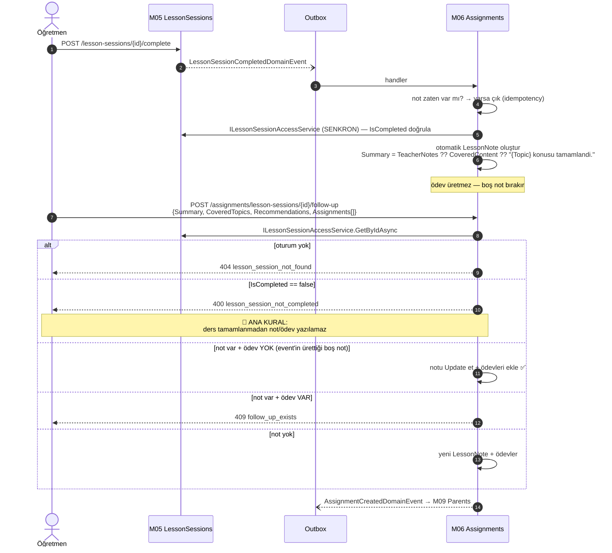
```mermaid
sequenceDiagram
    autonumber
    actor T as Öğretmen
    participant LS as M05 LessonSessions
    participant OB as Outbox
    participant AS as M06 Assignments

    T->>LS: POST /lesson-sessions/{id}/complete
    LS--)OB: LessonSessionCompletedDomainEvent
    OB->>AS: handler
    AS->>AS: not zaten var mı? → varsa çık (idempotency)
    AS->>LS: ILessonSessionAccessService (SENKRON) — IsCompleted doğrula
    AS->>AS: otomatik LessonNote oluştur<br/>Summary = TeacherNotes ?? CoveredContent ?? "{Topic} konusu tamamlandi."
    Note over AS: ödev üretmez — boş not bırakır

    T->>AS: POST /assignments/lesson-sessions/{id}/follow-up<br/>{Summary, CoveredTopics, Recommendations, Assignments[]}
    AS->>LS: ILessonSessionAccessService.GetByIdAsync
    alt oturum yok
        AS-->>T: 404 lesson_session_not_found
    else IsCompleted == false
        AS-->>T: 400 lesson_session_not_completed
        Note over AS,T: 🔑 ANA KURAL:<br/>ders tamamlanmadan not/ödev yazılamaz
    else not var + ödev YOK (event'in ürettiği boş not)
        AS->>AS: notu Update et + ödevleri ekle ✅
    else not var + ödev VAR
        AS-->>T: 409 follow_up_exists
    else not yok
        AS->>AS: yeni LessonNote + ödevler
    end
    AS--)OB: AssignmentCreatedDomainEvent → M09 Parents
```

**Sahiplik koruması:** Ödevlerin `StudentId`/`TeacherUserId`'si **istekten değil, `lessonSession`'dan** alınır
(`AssignmentFeatures.cs:156-158`) → istemci sahiplik spoof'layamaz.

#### Ödev durum makinesi — pratikte tek durumlu 🔴

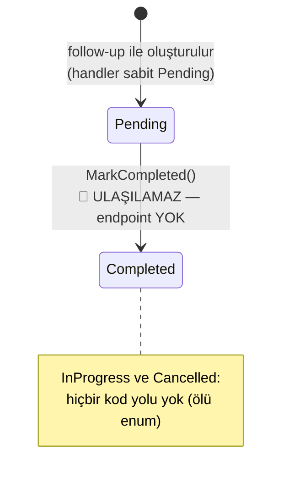
```mermaid
stateDiagram-v2
    [*] --> Pending: follow-up ile oluşturulur<br/>(handler sabit Pending)
    Pending --> Completed: MarkCompleted()<br/>🔴 ULAŞILAMAZ — endpoint YOK

    note right of Completed
        InProgress ve Cancelled:
        hiçbir kod yolu yok (ölü enum)
    end note
```

> 🔴 **"Teslim" kavramı kodda hiç yoktur.** `Assignment.MarkCompleted()` domain metodu var
> (`AssignmentsDomainModel.cs:59-65`) ama **hiçbir command/handler/endpoint onu çağırmaz** (repo geneli grep ile
> doğrulandı). Sonuçlar:
> - Öğrenci ödevi **teslim edemez, tamamlandı işaretleyemez**
> - `AssignmentCompletedDomainEvent` **hiç yayınlanmaz** → Parents'ın `RegisterAssignmentCompleted` dalı **ölü kod**
>   → **veli panosunda "tamamlanan ödev" her zaman 0**
> - İstenen "atandı → teslim → değerlendirildi" akışının kodda karşılığı: **yalnızca "atandı"**
>
> 🔴 **Geç teslim (late) mantığı yok.** `DueDateUtc` yalnızca saklanır — hiçbir yerde `now` ile karşılaştırılmaz,
> geçmiş tarih validasyonu bile yoktur. Gecikme hesabı tamamen istemciye kalmıştır.
>
> ⚠️ **Öğrenci ders özetini/önerilerini göremez.** `GET .../follow-up` authorizer'ı `CanManageTeacher` kullanır
> (`AssignmentPolicies.cs:77-92`) → öğrenciye **403**. Öğrenci yalnızca `GET /api/assignments` listesinden ödev
> başlıklarını görebilir; dersin özetini ve öğretmen önerilerini göremez.
>
> ⚠️ **CQRS ihlali:** `GET .../follow-up` sorgusu, not yoksa **yazma yapıp `SaveChanges` çağırır**
> (`AssignmentFeatures.cs:251-278`). Bir `GET` isteğinin yan etkisi vardır.

### 4.7 Adım 7 — Ödeme takibi (M07 Payments) 🟢

| Adım | Ekran | Endpoint |
|------|-------|----------|
| Kayıt oluştur | `/payments/new` | `POST /api/payments/records` |
| Kayıt düzenle / tahsilat / iptal | `/payments/edit` | `PUT /api/payments/records/{id}` |
| Liste | `/payments` | `GET /api/payments/teachers/{id}/records` |
| Arama + sayfalama | `/payments` | `GET .../records/search?q&status&studentId&skip&take` |
| Filtre | `/payments` | `GET .../records/filter?outstanding&overdue&paid&dateFrom&dateTo` |
| Özet + grafik | `/payments` | `GET .../teachers/{id}/summary` |

**Yetki:** Tüm uçlar Admin **veya** Teacher && self (`PaymentPolicies.cs:148-158`).
**Öğrenci ve veli Payments'a doğrudan erişemez** — veli yalnızca Parents snapshot'ından görür.

#### Ödeme durum makinesi — ⚠️ istemci güdümlü

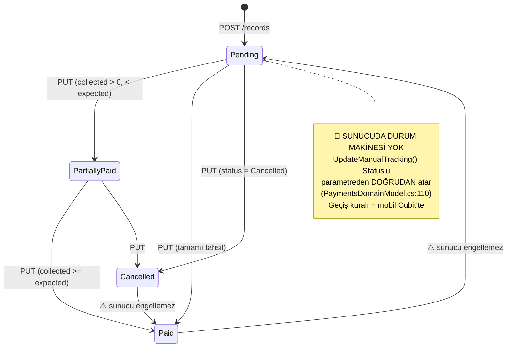
```mermaid
stateDiagram-v2
    [*] --> Pending: POST /records
    Pending --> PartiallyPaid: PUT (collected > 0, < expected)
    PartiallyPaid --> Paid: PUT (collected >= expected)
    Pending --> Paid: PUT (tamamı tahsil)
    Pending --> Cancelled: PUT (status = Cancelled)
    PartiallyPaid --> Cancelled: PUT
    Paid --> Pending: ⚠️ sunucu engellemez
    Cancelled --> Paid: ⚠️ sunucu engellemez

    note right of Pending
        🔴 SUNUCUDA DURUM MAKİNESİ YOK
        UpdateManualTracking() Status'u
        parametreden DOĞRUDAN atar
        (PaymentsDomainModel.cs:110)
        Geçiş kuralı = mobil Cubit'te
    end note
```

**Gerçek geçiş kuralı istemcidedir** (`payments_cubit.dart:226-294`):
```
newCollected = clamp(collected + amountNow, 0, expected)
durum: >= expected → Paid | > 0 → PartiallyPaid | aksi → Pending
```

**Sunucunun tek doğrulaması:** `0 <= CollectedAmount <= ExpectedAmount` (`PaymentPolicies.cs:25,41`).

#### `Overdue` bir durum değil, **türetilmiş görünümdür**

Bu ayrım dokümanın en sık yanlış anlaşılan noktasıdır:

| Kalıcı durum (DB) | Türetilen (yanıt) |
|-------------------|-------------------|
| `Pending`, `PartiallyPaid`, `Paid`, `Cancelled` | `Overdue` = `Outstanding > 0 && DueDateUtc < now` |

`GetOutstandingAmount()` (`PaymentFeatures.cs:471`): **`Cancelled` ise 0** — iptal borç doğurmaz.
`GetDisplayStatus(now)` (`:493`): overdue ise `Overdue`, değilse gerçek `Status`.

**İş kuralları:**
- **Silme yok, iptal var.** DELETE endpoint'i yoktur; iptal = `PUT` ile `Status=Cancelled`, `collected` korunur, `outstanding=0`
- **Kısmi tahsilat:** `CollectPaymentSheet` varsayılan olarak kalanın tamamını doldurur; `> outstanding` girilemez
- **Düzenlemede öğrenci/ders salt-okunur, kilitli** (`payment_form_page.dart:568`)
- **Sayfalama:** `DefaultTake=20`, `MaxTake=100`; sıralama `DueDateUtc` → `Description`
- **Grafik serisi:** son 6 ay, `DueDateUtc` ayına göre, **`Cancelled` hariç** (`PaymentFeatures.cs:297-318`)

> ⚠️ **Sayfalama bellekte yapılıyor.** Repo öğretmenin **tüm** kayıtlarını çeker
> (`PaymentRecordRepository.cs:21`), filtre/skip/take LINQ-to-Objects ile uygulanır. Kayıt sayısı büyüdükçe sorun olur.
>
> ⚠️ **Para birimleri toplanıyor.** `PaymentSummary.collectedTotal/outstandingTotal/overdueTotal` currency ayırmadan
> toplar — yorumda "TRY-öncelikli" denir ama fiilen TRY + USD toplanır.
>
> ⚠️ **Ödeme yöntemi için ayrı alan yok** — `Notes` alanına `"Ödeme yöntemi: X\n<not>"` şeklinde gömülür
> (`payment_form_page.dart:460`).
>
> 🔴 **Taksit / ödeme planı kodda hiç yok.** `installment|taksit|PaymentPlan` grep'i `src` ve `mobile/lib` genelinde
> **sıfır sonuç**. En yakın kavram `BillingItemType.MonthlyPackage` + `BillingPeriodStart/EndUtc`'dir; bunlar tekil
> kayıt üzerinde **dönem etiketidir**, taksit planı değildir.

### 4.8 Öğretmenin ekranları ve navigasyonu

6 sekmeli `AppBottomNav` (`app_bottom_nav.dart:14-31`):
`Ana sayfa /dashboard` · `Dersler /lesson-sessions` · `Öğrenciler /students` · `Takvim /scheduling` ·
`Finans /payments` · `Diğer /more`

> 🔴 **`/more` menüsünün çoğu sahtedir.** Abonelik / Raporlar / Ayarlar / Bildirim / Çalışma / Tatil sheet'lerinin
> **hiçbiri backend'e yazmaz** — state yalnızca lokal `setState`'tir (`more_page.dart:20-30, 184-354`).
> M15 Settings tablosu migrate edilmiştir ama **hiçbir kod onu okuyup yazmaz**.

---

## 5. 🎓 ÖĞRENCİ — A'dan Z'ye

Öğrenci deneyimi **tamamen bireysel çalışma etrafında** kuruludur ve platformun geri kalanından **izoledir**.

### 5.1 Öğrencinin tam iş akışı

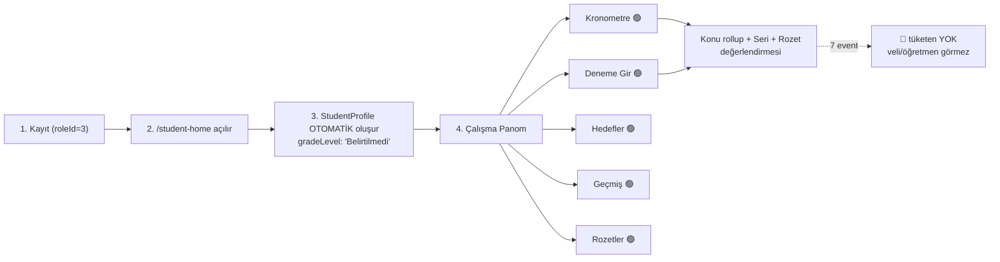
```mermaid
flowchart LR
    A["1. Kayıt (roleId=3)"] --> B["2. /student-home açılır"]
    B --> C["3. StudentProfile OTOMATİK oluşur<br/>gradeLevel: 'Belirtilmedi'"]
    C --> D["4. Çalışma Panom"]
    D --> E["Kronometre 🟢"]
    D --> F["Deneme Gir 🟢"]
    D --> G["Hedefler 🟢"]
    D --> H["Geçmiş 🟢"]
    D --> I["Rozetler 🟢"]
    E --> J["Konu rollup + Seri + Rozet<br/>değerlendirmesi"]
    F --> J
    J -.->|"7 event"| K["🔴 tüketen YOK<br/>veli/öğretmen görmez"]
```

### 5.2 Öğrencinin görebildikleri ve göremedikleri

| Yetenek | Durum | Kanıt |
|---------|:-----:|-------|
| Kendi çalışma paneli (M08) | 🟢 | `/student-home` |
| Kronometre (başlat/duraklat/sürdür/tamamla/iptal) | 🟢 | `/study/timer` |
| Manuel çalışma girişi | 🟢 | `POST /api/study/sessions/manual` |
| Deneme sonucu girişi + net trendi | 🟢 | `/study/test` |
| Hedef belirleme (günlük/haftalık dk, hedef net) | 🟢 | `/study/goals` |
| Geçmiş (seans / deneme / haftalık özet) | 🟢 | `/study/history` |
| Rozetler + seri (streak) | 🟢 | `/study/achievements` |
| **Kendi ders oturumunu görme** | 🟢 | `GET /api/lesson-sessions/{id}` — `StudentId` eşleşmesi |
| **Kendi ödev listesini görme** | 🟢 | `GET /api/assignments` — filtre sunucuda zorlanır |
| Ders özeti / öğretmen önerilerini görme | 🔴 | `GET .../follow-up` → **403** |
| **Ödev teslim etme** | 🔴 | `MarkCompleted()` endpoint'i **yok** |
| Ders takvimini görme | 🔴 | Scheduling öğrenciye tamamen kapalı |
| Bildirim ekranı | 🔴 | `/notifications` yalnızca öğretmen endpoint'i çağırır |
| Kendi profilini güncelleme | 🔴 | Authorizer `SelfRegistered` öğrenciyi kabul etmez |
| Öğretmenle mesajlaşma | 🔴 | M16 iskelet |

### 5.3 Çalışma seansı durum makinesi 🟢

**Projedeki tek tam implement edilmiş durum makinesi.**

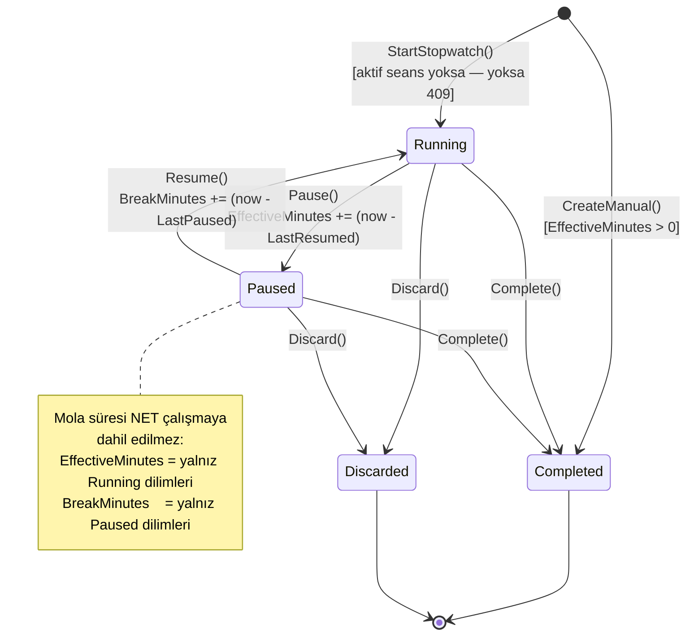
```mermaid
stateDiagram-v2
    [*] --> Running: StartStopwatch()<br/>[aktif seans yoksa — yoksa 409]
    [*] --> Completed: CreateManual()<br/>[EffectiveMinutes > 0]

    Running --> Paused: Pause()<br/>EffectiveMinutes += (now - LastResumed)
    Paused --> Running: Resume()<br/>BreakMinutes += (now - LastPaused)
    Running --> Completed: Complete()
    Paused --> Completed: Complete()
    Running --> Discarded: Discard()
    Paused --> Discarded: Discard()

    Completed --> [*]
    Discarded --> [*]

    note right of Paused
        Mola süresi NET çalışmaya
        dahil edilmez:
        EffectiveMinutes = yalnız Running dilimleri
        BreakMinutes    = yalnız Paused dilimleri
    end note
```

**Guard'lar domainde `InvalidOperationException` fırlatır** (diğer modüllerin `Result.Failure` deseninden farklı):
- `Pause`: `Status != Running` → *"Yalnızca çalışan bir seans molaya alınabilir."*
- `Resume`: `Status != Paused` → *"Yalnızca moladaki bir seans sürdürülebilir."*
- `Complete`: `Status not in (Running, Paused)` → *"Yalnızca aktif bir seans tamamlanabilir."*
- `Discard`: `Status == Completed` → *"Tamamlanmış seans iptal edilemez."*

> ⚠️ **Bu exception'lar handler'larda yakalanmıyor** (`StudySessionFeatures.cs:225,251,280,307`) →
> geçersiz durum geçişi **HTTP 500** üretir, 409 değil.
>
> **Tek aktif seans kuralı:** `Running` **veya** `Paused` bir seans varken yeni seans başlatılamaz →
> `409 study.session_active`.

### 5.4 Seans tamamlanınca ne oluyor? (`StudyCompletionService`)

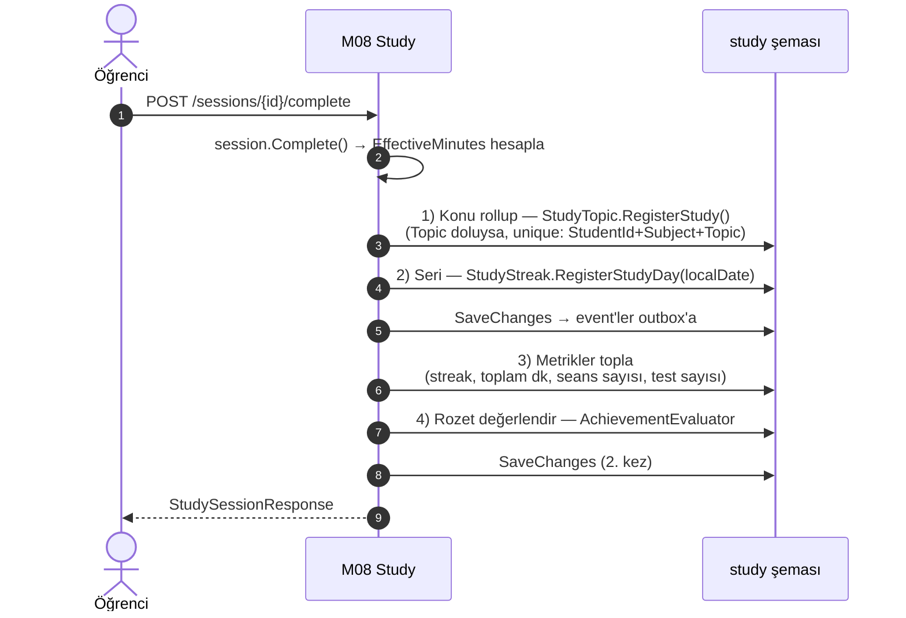
```mermaid
sequenceDiagram
    autonumber
    actor S as Öğrenci
    participant API as M08 Study
    participant DB as study şeması

    S->>API: POST /sessions/{id}/complete
    API->>API: session.Complete() → EffectiveMinutes hesapla
    API->>DB: 1) Konu rollup — StudyTopic.RegisterStudy()<br/>(Topic doluysa, unique: StudentId+Subject+Topic)
    API->>DB: 2) Seri — StudyStreak.RegisterStudyDay(localDate)
    API->>DB: SaveChanges → event'ler outbox'a
    API->>DB: 3) Metrikler topla<br/>(streak, toplam dk, seans sayısı, test sayısı)
    API->>DB: 4) Rozet değerlendir — AchievementEvaluator
    API->>DB: SaveChanges (2. kez)
    API-->>S: StudySessionResponse
```

### 5.5 Seri (streak) durum makinesi 🟢

Öğrencinin **yerel gününe** göre çalışır — `StudyLocalTime.LocalDate`, **UTC+3 sabit**
(`StudyPolicies.cs:11-19`, yorumu: *"M15 Settings devreye girene kadar"*).

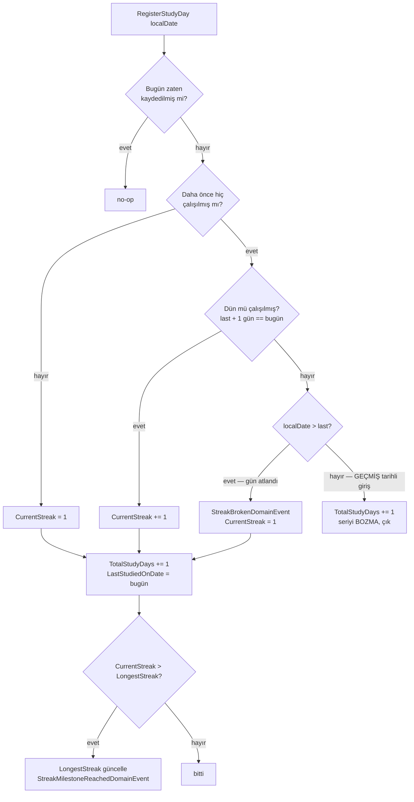
```mermaid
flowchart TD
    A[RegisterStudyDay localDate] --> B{Bugün zaten<br/>kaydedilmiş mi?}
    B -->|evet| C[no-op]
    B -->|hayır| D{Daha önce hiç<br/>çalışılmış mı?}
    D -->|hayır| E[CurrentStreak = 1]
    D -->|evet| F{Dün mü çalışılmış?<br/>last + 1 gün == bugün}
    F -->|evet| G[CurrentStreak += 1]
    F -->|hayır| H{localDate > last?}
    H -->|evet — gün atlandı| I["StreakBrokenDomainEvent<br/>CurrentStreak = 1"]
    H -->|hayır — GEÇMİŞ tarihli giriş| J["TotalStudyDays += 1<br/>seriyi BOZMA, çık"]
    E --> K[TotalStudyDays += 1<br/>LastStudiedOnDate = bugün]
    G --> K
    I --> K
    K --> L{CurrentStreak > LongestStreak?}
    L -->|evet| M["LongestStreak güncelle<br/>StreakMilestoneReachedDomainEvent"]
    L -->|hayır| N[bitti]
```

**Zarif detay:** Geçmiş tarihli manuel giriş **seriyi bozmaz** — yalnızca `TotalStudyDays` artar,
`LastStudiedOnDate` güncellenmez (`StudyDomainModel.cs:447-451`).

### 5.6 Deneme (test) ve net hesabı 🟢

**Net formülü** (`StudyDomainModel.cs:280`):
```
Net = Round(correct - (wrong / penaltyDivisor), 2, AwayFromZero)
penaltyDivisor varsayılan 4 → "4 yanlış 1 doğruyu götürür"
```

**Invariant'lar:** `correct + wrong + blank == totalQuestions` (aksi → hata) · tüm sayılar `>= 0` ·
`penaltyDivisor <= 0` ise **sessizce 4'e düzeltilir** · `TakenOnUtc > now + 1dk` → `study.invalid_request`
(**gelecek tarih engeli**).

`TestType` parse'ı **toleranslı**: geçersiz string → sessizce `TestType.General`.

**Not:** Deneme kaydı rozet değerlendirmesini tetikler ama **konu rollup ve seri güncellemesi yapmaz** —
deneme çözmek seri saymaz (`StudyTestFeatures.cs:90-98`).

### 5.7 Rozet sistemi 🟢

**Katalog seed'li** (`StudyDbContext.cs:115-125`):

| Kod | Kategori | Eşik |
|-----|----------|------|
| `FIRST_SESSION` | Consistency | 1 seans |
| `SESSIONS_10` | Consistency | 10 seans |
| `STREAK_3` / `STREAK_7` / `STREAK_30` | Streak | 3 / 7 / 30 gün |
| `HOURS_10` / `HOURS_50` / `HOURS_100` | StudyTime | 600 / 3000 / 6000 dk |
| `FIRST_TEST` / `TESTS_10` | TestPerformance | 1 / 10 deneme |

> ⚠️ **`AchievementCategory.Goal` rozetleri asla kazanılamaz** — `ValueFor(Goal)` daima `0` döner ve
> `Threshold > 0` koşulu onları eler (`StudyPolicies.cs:180-187`). Neyse ki katalogda Goal kategorisinde
> seed yoktur, yani şu an tutarlı.

### 5.8 🔴 Öğrenci tarafının en kritik boşlukları

| # | Bulgu | Etki |
|---|-------|------|
| 1 | **Paylaşım bayrakları ölü.** `IsSharedWithParent`/`IsSharedWithTeacher` yazılır ve `StudySharingResponse` ile okunur, ama **hiçbir sorguda filtre olarak kullanılmaz**. Study'de öğretmen/veli için **hiç okuma endpoint'i yoktur.** | "Veliyle paylaş" özelliği UI vaadi olarak var, **işlevsel karşılığı yok** |
| 2 | **Study'nin 7 event'inin de tüketicisi yok** (`StudySessionStarted/Completed`, `TestResultRecorded`, `StudyGoalUpdated`, `StreakMilestoneReached`, `StreakBroken`, `AchievementEarned`) | Öğrencinin hiçbir başarısı veliye/öğretmene/bildirime ulaşmaz |
| 3 | **TOFU açığı (`StudyOwnershipGuard`, `StudyPolicies.cs:67-92`):** `StudyStudent` bağı **yoksa** guard `Success` döner. Yani **herhangi bir giriş yapmış kullanıcı** rastgele bir `studentId` için `POST /sessions/start` çağırıp o `studentId`'yi **kendi hesabına kalıcı bağlayabilir** → gerçek öğrenci kilitlenir. `StudentId`'nin M03'e ait olduğu **hiç doğrulanmaz.** | 🔴 **Güvenlik açığı** |
| 4 | **Alt navigasyon yok** — öğretmen/veli'de var, öğrencide yok. Ayarlar için öğrencinin **öğretmen `/more` ekranına** düşmesi gerekiyor | UX tutarsızlığı |
| 5 | **Mock fallback yok** — `StudyRepository`, `AppConfig` almayan tek repo (`injector.dart:110-112`). Backend `/api/study/*` ayakta değilse **tüm öğrenci ekranları hata verir**; öğretmen/veli mock'la çalışmaya devam eder | Dev deneyimi |
| 6 | **4/6 ekran Cubit'siz** — `study_goals_page`, `study_history_page`, `test_entry_page`, `achievements_page` presentation'dan doğrudan `injector<StudyRepository>()` çözüyor | Katman ihlali |
| 7 | **Pano performansı:** `GetStudyDashboardQueryHandler` **tüm seansları ve tüm testleri** çekip bellekte `Take(5)` yapıyor (`StudyProgressFeatures.cs:261,300`) | Ölçek sorunu |

---

## 6. 👪 VELİ — A'dan Z'ye

Veli **gerçek bir Identity kullanıcısıdır** (`ParentProfile.UserId` zorunlu + unique) ve platformun geri kalanına
**hiç dokunmaz** — yalnızca Parents modülünün kendi read-model'inden okur.

### 6.1 Velinin tam iş akışı

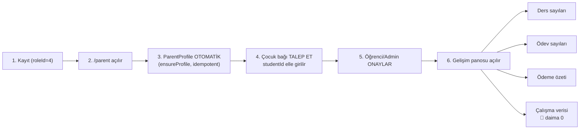
```mermaid
flowchart LR
    A["1. Kayıt (roleId=4)"] --> B["2. /parent açılır"]
    B --> C["3. ParentProfile OTOMATİK<br/>(ensureProfile, idempotent)"]
    C --> D["4. Çocuk bağı TALEP ET<br/>studentId elle girilir"]
    D --> E["5. Öğrenci/Admin ONAYLAR"]
    E --> F["6. Gelişim panosu açılır"]
    F --> G["Ders sayıları"]
    F --> H["Ödev sayıları"]
    F --> I["Ödeme özeti"]
    F --> J["Çalışma verisi<br/>🔴 daima 0"]
```

### 6.2 ⭐ Çocuk bağlama — platformun en kritik akışı

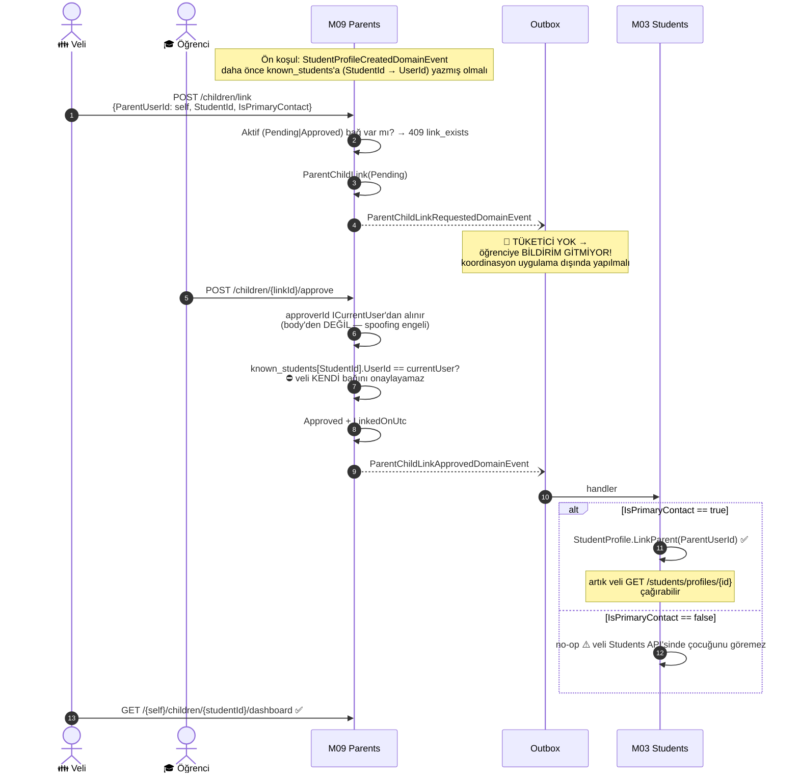
```mermaid
sequenceDiagram
    autonumber
    actor V as 👪 Veli
    actor S as 🎓 Öğrenci
    participant PRT as M09 Parents
    participant OB as Outbox
    participant STU as M03 Students

    Note over PRT: Ön koşul: StudentProfileCreatedDomainEvent<br/>daha önce known_students'a (StudentId → UserId) yazmış olmalı

    V->>PRT: POST /children/link<br/>{ParentUserId: self, StudentId, IsPrimaryContact}
    PRT->>PRT: Aktif (Pending|Approved) bağ var mı? → 409 link_exists
    PRT->>PRT: ParentChildLink(Pending)
    PRT--)OB: ParentChildLinkRequestedDomainEvent
    Note over OB: 🔴 TÜKETİCİ YOK →<br/>öğrenciye BİLDİRİM GİTMİYOR!<br/>koordinasyon uygulama dışında yapılmalı

    S->>PRT: POST /children/{linkId}/approve
    PRT->>PRT: approverId ICurrentUser'dan alınır<br/>(body'den DEĞİL — spoofing engeli)
    PRT->>PRT: known_students[StudentId].UserId == currentUser?<br/>⛔ veli KENDİ bağını onaylayamaz
    PRT->>PRT: Approved + LinkedOnUtc
    PRT--)OB: ParentChildLinkApprovedDomainEvent
    OB->>STU: handler
    alt IsPrimaryContact == true
        STU->>STU: StudentProfile.LinkParent(ParentUserId) ✅
        Note over STU: artık veli GET /students/profiles/{id}<br/>çağırabilir
    else IsPrimaryContact == false
        STU->>STU: no-op ⚠️ veli Students API'sinde çocuğunu göremez
    end

    V->>PRT: GET /{self}/children/{studentId}/dashboard ✅
```

#### Bağ durum makinesi

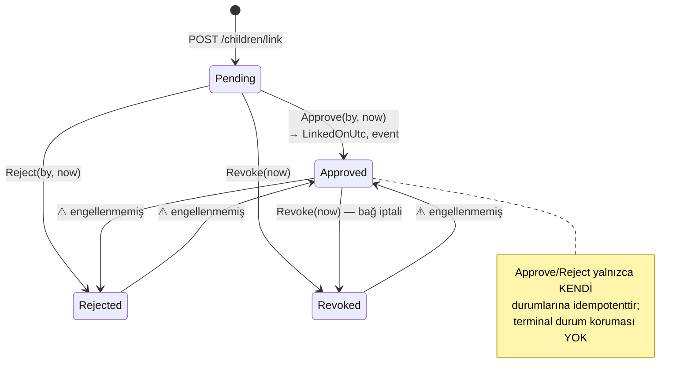
```mermaid
stateDiagram-v2
    [*] --> Pending: POST /children/link
    Pending --> Approved: Approve(by, now)<br/>→ LinkedOnUtc, event
    Pending --> Rejected: Reject(by, now)
    Pending --> Revoked: Revoke(now)
    Approved --> Revoked: Revoke(now) — bağ iptali

    Approved --> Rejected: ⚠️ engellenmemiş
    Rejected --> Approved: ⚠️ engellenmemiş
    Revoked --> Approved: ⚠️ engellenmemiş

    note right of Approved
        Approve/Reject yalnızca KENDİ
        durumlarına idempotenttir;
        terminal durum koruması YOK
    end note
```

#### Kim ne yapabilir?

| İşlem | Yetkili | Not |
|-------|---------|-----|
| Bağ **talep** et | Veli (self) veya Admin | |
| Bağ **onayla** | **Admin veya öğrencinin kendisi** | ⛔ Veli kendi bağını onaylayamaz (self-approve engeli) |
| Bağ **reddet** | **Admin veya öğrencinin kendisi** | |
| Bağ **iptal** (revoke) | Admin **veya** bağın velisi **veya** öğrenci | Her iki taraf da bozabilir |

> ⚠️ **Endpoint özeti kodla çelişiyor:** `ParentsModule.cs:42` "öğrenci/öğretmen/Admin onaylar" der; kodda
> **öğretmen dalı yoktur** (`ParentPolicies.cs:149-177`). `ParentsDomainModel.cs:100` sınıf yorumu da aynı hatayı tekrarlar.
>
> ⚠️ **Fail-closed davranış:** `known_students` kaydında `UserId is null` ise (yani öğretmenin `TeacherManaged`
> olarak eklediği, hesabı olmayan öğrenci) bağı **yalnızca Admin onaylayabilir**. Bu güvenli ama ürün açısından
> darboğazdır — öğretmenin eklediği her öğrencinin velisi Admin'e muhtaçtır.
>
> ⚠️ **`InviteCode` ölü alan** — istek gövdesinde taşınır, entity'de saklanır, **hiçbir yerde doğrulanmaz**.
>
> 🔴 **Revoke sonrası erişim sızıntısı — en ciddi tutarsızlık:** `ParentChildLinkRevokedDomainEvent`'in
> **tüketicisi yoktur**. Bağ iptal edilse bile `StudentProfile.ParentUserId` **temizlenmez**. Sonuç:
> - Parents dashboard'u → `403 link_not_approved` ✅ (doğru)
> - `GET /api/students/profiles/{id}` → **hâlâ veliye açık** ❌ (`StudentProfilePolicies.cs:176` `ParentUserId`'ye bakar)
>
> **Veli, bağ iptal edildikten sonra da çocuğunun öğrenci profiline erişmeye devam eder.**

### 6.3 Velinin gelişim panosu

Veli **hiçbir öğretmen modülüne sorgu atmaz.** Parents modülü event'lerle kendi `ChildProgressSnapshot`
tablosunu doldurur (öğrenci başına tek satır, `StudentId` unique):

```mermaid
graph LR
    M05["M05 LessonSessions"] -->|"LessonSessionCreated → PlannedLessonCount++<br/>LessonSessionCompleted → CompletedLessonCount++"| SNAP["ChildProgressSnapshot"]
    M06["M06 Assignments"] -->|"AssignmentCreated → Total/OpenCount++<br/>AssignmentCompleted → 🔴 hiç yayınlanmıyor"| SNAP
    M07["M07 Payments"] -->|"PaymentRecordCreated/Updated →<br/>Expected/Collected/Outstanding"| SNAP
    M08["M08 Study"] -.->|"🔴 BAĞLANTI YOK"| SNAP
    SNAP --> V["👪 Veli panosu"]
```

| Pano bölümü | Kaynak | Durum |
|-------------|--------|:-----:|
| Planlanan / tamamlanan ders sayısı | M05 event'leri | 🟢 (⚠️ tekrar-tamamlama sayacı şişirebilir) |
| Toplam / açık ödev sayısı | M06 event'leri | 🟡 |
| **Tamamlanan ödev sayısı** | M06 `AssignmentCompleted` | 🔴 **daima 0** — event hiç yayınlanmıyor |
| Beklenen / tahsil edilen / kalan ödeme | M07 event'leri | 🟢 |
| **Haftalık çalışma dakikası + seri** | M08 Study | 🔴 **daima 0** — modüller arası bağ yok |

**Gizlilik kuralı:** `GET /{parentUserId}/children` tüm bağları döndürür (her statü), ama **`Progress` yalnızca
`Approved` olanlarda doludur** — diğerlerinde `null` (`ParentFeatures.cs:363-369`).

**Dashboard erişimi:** `GET .../children/{studentId}/dashboard` bağ `Approved` değilse **403 link_not_approved**.
Snapshot yoksa **404 değil, sıfır dolu dashboard** döner.

### 6.4 Velinin ekranları — 5/5 tam uygulanmış 🟢

4 sekmeli **ayrı** `ParentBottomNav` (`parent_widgets.dart:8-20`) — öğretmenin `AppBottomNav`'inden bilinçli olarak ayrıdır.

| Ekran | Rota | Ne yapıyor |
|-------|------|------------|
| Ana panel | `/parent` | Çocuk seçici chip'leri, 4'lü stat grid, haftalık çalışma bar grafiği, ödeme özeti |
| Çocuklarım | `/parent/children` | Bağlı çocuk listesi + durum rozeti; FAB → **öğrenci ID'si elle girilerek** bağ talebi |
| Bildirim tercihleri | `/parent/notifications` | 5 switch + kanal → `PUT .../notification-preferences` |
| Profil | `/parent/profile` | İletişim kartı (salt okunur) + menü + çıkış |
| Gelişim detayı | `/parent/child-detail` | Tek çocuğun detay paneli |

**Bildirim tercihleri** (`ParentProfile` varsayılanları, `ParentsDomainModel.cs:31-36`):

| Tercih | Varsayılan |
|--------|:----------:|
| `MissedAssignment` (eksik ödev) | ✅ açık |
| `WeeklyProgressSummary` (haftalık özet) | ✅ açık |
| `TestResults` (deneme sonuçları) | ✅ açık |
| `LessonReminders` (ders hatırlatma) | ❌ kapalı |
| `Payments` (ödeme) | ❌ kapalı |
| `NotificationChannel` | `Push` |

> 🔴 **Bu tercihlerin HİÇBİR tüketicisi yok.** Kaydedilir, okunur, ekranda gösterilir — ama hiçbir bildirim
> gönderilmez. M11 Notifications yalnızca öğretmene ders hatırlatması üretir ve o bile fiilen hiçbir yere gönderilmez
> (yalnızca DB'de `Sent` işaretlenir).
>
> ⚠️ **Bağ talebinde öğrenci ID'si elle giriliyor** (`parent_children_page.dart:135-144`) — arama/davet kodu
> akışı yoktur. Veli, çocuğunun `StudentId` GUID'ini bir şekilde öğrenmek zorundadır.
>
> ⚠️ **`ParentCubit._loadDashboard` `ApiException`'ı sessizce yutar** (`parent_cubit.dart:158`) —
> onay bekleyen çocukta panel boş kalır, hata gösterilmez.
>
> ⚠️ **N+1 sorgu:** `ListChildrenQueryHandler` her bağ için ayrı snapshot sorgusu atar (`ParentFeatures.cs:363-369`).

### 6.5 🔴 Veli tarafında olmayan

- Ödev/ders **listesi detayı** — yalnızca dashboard'daki toplu sayılar
- Öğretmenle **mesajlaşma** (M16 iskelet)
- **Profil düzenleme** — veli profili salt okunur
- **Çocuğu için öğrenci profili oluşturma** — authorizer Parent rolünü kabul etmez

---

## 7. Uçtan uca birleşik akış — üç rol bir arada

```mermaid
sequenceDiagram
    autonumber
    actor T as 👨‍🏫 Öğretmen
    actor S as 🎓 Öğrenci
    actor V as 👪 Veli
    participant SCH as M04 Scheduling
    participant NOT as M11 Notifications
    participant LS as M05 LessonSessions
    participant AS as M06 Assignments
    participant PAY as M07 Payments
    participant PRT as M09 Parents
    participant STU as M08 Study

    rect rgb(240, 248, 255)
    Note over T,SCH: 1) PLANLAMA — yalnızca Teacher/Admin
    T->>SCH: POST /scheduling/lessons
    SCH->>SCH: aralık + öğretmen çakışması (Cancelled hariç)
    SCH--)NOT: LessonScheduledDomainEvent
    NOT->>NOT: LessonReminder(Pending, Start - offset, InApp)
    end

    rect rgb(245, 255, 245)
    Note over T,LS: 2) OTURUM — ⚠️ Scheduling ile bağ doğrulanmıyor
    T->>LS: POST /lesson-sessions {LessonScheduleId?}
    LS--)PRT: LessonSessionCreated → PlannedLessonCount++
    T->>LS: POST /lesson-sessions/{id}/complete
    LS--)PRT: LessonSessionCompleted → CompletedLessonCount++
    LS--)AS: LessonSessionCompleted → otomatik boş LessonNote
    end

    rect rgb(255, 250, 240)
    Note over T,AS: 3) NOT + ÖDEV
    T->>AS: POST /assignments/lesson-sessions/{id}/follow-up
    AS->>LS: ILessonSessionAccessService (senkron) — IsCompleted?
    AS--)PRT: AssignmentCreated → OpenAssignmentCount++
    end

    rect rgb(255, 245, 250)
    Note over T,PAY: 4) TAHSİLAT
    T->>PAY: POST /payments/records → PUT (kısmi/tam/iptal)
    PAY--)PRT: PaymentRecordCreated/Updated → tutar alanları
    end

    rect rgb(250, 245, 255)
    Note over S,AS: 5) ÖĞRENCİ — okuma sınırlı
    S->>LS: GET /lesson-sessions/{id} ✅
    S->>AS: GET /assignments ✅ (filtre zorlanır)
    S--xAS: GET .../follow-up ❌ 403
    S--xAS: ödev teslim et ❌ endpoint YOK
    S--xSCH: takvimi gör ❌ 403
    end

    rect rgb(245, 250, 255)
    Note over S,STU: 6) ÖĞRENCİ ÇALIŞMA — tamamen izole
    S->>STU: sessions/start → pause/resume → complete
    STU->>STU: konu rollup + seri + rozet
    STU--)STU: 7 event → 🔴 tüketen YOK
    end

    rect rgb(255, 248, 240)
    Note over V,PRT: 7) VELİ — yalnızca read-model
    V->>PRT: POST /children/link → Pending
    S->>PRT: POST /children/{id}/approve → Approved
    PRT--)LS: (Students'a) LinkParent
    V->>PRT: GET /children/{id}/dashboard ✅
    Note over V,PRT: tamamlanan ödev = 0 🔴<br/>çalışma dakikası = 0 🔴
    V--xLS: GET /lesson-sessions ❌ boş
    V--xPAY: GET /payments ❌ 403
    end
```

---

## 8. Rol × yetenek × endpoint matrisi

| Yetenek | 👨‍🏫 | 🎓 | 👪 | Endpoint | Durum |
|---------|:--:|:--:|:--:|----------|:-----:|
| Kayıt / giriş / token yenileme | ✅ | ✅ | ✅ | `/api/identity/*` | 🟢 |
| Şifre sıfırlama (API) | ✅ | ✅ | ✅ | `/api/identity/password-reset/*` | 🟡 ekran yok |
| E-posta doğrulama | ✅ | ✅ | ✅ | `/api/identity/email-verification/*` | 🟡 e-posta gitmiyor |
| Öğretmen profili yönet | ✅ | ❌ | ❌ | `/api/teachers/profiles` | 🟢 |
| Öğretmen profili **gör** | ✅ | ✅ | ✅ | `GET /api/teachers/profiles/{id}` | 🟢 |
| Öğretmen doğrulama (`IsVerified`) | — | — | — | — | 🔴 |
| Öğrenci ekle (TeacherManaged) | ✅ | ❌ | ❌ | `POST /api/students/profiles` | 🟢 |
| Öğrenci kendi profilini aç | ❌ | ✅ | ❌ | `POST /api/students/profiles` | 🟢 |
| Öğrenci profilini güncelle | ✅ (kendi eklediği) | ❌ | ❌ | `PUT /api/students/profiles/{id}` | 🟢 |
| Öğrenci profilini gör | ✅ | ✅ | ✅ (bağ onaylıysa) | `GET /api/students/profiles/{id}` | 🟢 |
| Ders planla / güncelle / iptal / tamamla | ✅ | ❌ | ❌ | `/api/scheduling/lessons*` | 🟢 |
| Takvimi gör | ✅ | ❌ | ❌ | `GET /api/scheduling/teachers/{id}/lessons` | 🟢 |
| Tekrarlayan ders | — | — | — | — | 🔴 |
| Ders oturumu aç / tamamla | ✅ | ❌ | ❌ | `/api/lesson-sessions` | 🟢 |
| Ders oturumunu gör | ✅ | ✅ | ❌ | `GET /api/lesson-sessions/{id}` | 🟢 |
| Ders notu + ödev yaz | ✅ | ❌ | ❌ | `POST .../follow-up` | 🟢 |
| Ders özetini gör | ✅ | ❌ | ❌ | `GET .../follow-up` | 🟡 |
| Ödev listesini gör | ✅ | ✅ | ❌ | `GET /api/assignments` | 🟢 |
| **Ödev teslim et** | — | ❌ | — | — | 🔴 |
| Ödeme kaydı yönet | ✅ | ❌ | ❌ | `/api/payments/records*` | 🟢 |
| Ödeme özeti + grafik | ✅ | ❌ | ❌ | `GET .../summary` | 🟢 |
| Ödeme özetini gör (veli) | — | — | ✅ | Parents snapshot | 🟡 |
| Taksit / ödeme planı | — | — | — | — | 🔴 |
| Ders hatırlatması (liste) | ✅ | ❌ | ❌ | `GET /api/notifications/teachers/{id}/lesson-reminders` | 🟡 |
| Çalışma kronometresi | ❌ | ✅ | ❌ | `/api/study/sessions/*` | 🟢 |
| Deneme + net trendi | ❌ | ✅ | ❌ | `/api/study/test-results` | 🟢 |
| Hedef / seri / rozet | ❌ | ✅ | ❌ | `/api/study/students/{id}/*` | 🟢 |
| Çalışma verisini paylaş | ❌ | 🟡 bayrak var | 🔴 göremez | `PUT .../sharing` | 🔴 |
| Veli profili | ❌ | ❌ | ✅ | `/api/parents/profiles` | 🟢 |
| Çocuk bağı talep | ❌ | ❌ | ✅ | `POST /api/parents/children/link` | 🟢 |
| Çocuk bağı onayla/reddet | ❌ | ✅ | ❌ | `POST .../approve` / `.../reject` | 🟢 |
| Çocuk bağı iptal | ❌ | ✅ | ✅ | `POST .../revoke` | 🟢 |
| Gelişim panosu | ❌ | ❌ | ✅ | `GET .../children/{id}/dashboard` | 🟡 |
| Bildirim tercihleri | ❌ | ❌ | ✅ | `PUT .../notification-preferences` | 🟡 tüketici yok |
| Mesajlaşma | ❌ | ❌ | ❌ | — | 🔴 M16 |
| Öğretmen bulma / ilan | ❌ | ❌ | ❌ | — | 🔴 M12 |
| Değerlendirme / puan | ❌ | ❌ | ❌ | — | 🔴 M13 |
| Rapor | ❌ | ❌ | ❌ | — | 🔴 M14 |
| Ayarlar | 🟡 sahte UI | ❌ | ❌ | — | 🔴 M15 |
| Üyelik / abonelik | 🟡 sahte UI | ❌ | ❌ | — | 🔴 M17 |

---

## 9. Modüller arası event haritası

```mermaid
graph LR
    subgraph Calisan["✅ Çalışan zincirler"]
        A1["M04 Scheduling"] -->|LessonScheduled| B1["M11 Notifications"]
        A1 -->|LessonScheduleCancelled| B1
        A2["M05 LessonSessions"] -->|LessonSessionCreated| C1["M09 Parents"]
        A2 -->|LessonSessionCompleted| C1
        A2 -->|LessonSessionCompleted| D1["M06 Assignments"]
        A3["M06 Assignments"] -->|AssignmentCreated| C1
        A4["M07 Payments"] -->|PaymentRecordCreated/Updated| C1
        A5["M03 Students"] -->|StudentProfileCreated| C1
        C1 -->|ParentChildLinkApproved| A5
        A2 -.->|"ILessonSessionAccessService<br/>(SENKRON sözleşme)"| D1
    end

    subgraph Kopuk["🔴 Tüketicisi olmayan event'ler"]
        X1["M01 UserRegistered"] --> N1((yok))
        X2["M02 TeacherProfileCreated/Updated"] --> N1
        X3["M04 LessonScheduleRescheduled"] --> N1
        X4["M04 LessonSessionCompleted<br/>⚠️ isim çakışması"] --> N1
        X5["M06 LessonNoteCreated"] --> N1
        X6["M06 AssignmentCompleted<br/>⚠️ hiç yayınlanmıyor"] --> N1
        X7["M07 PaymentRecordCreated/Updated<br/>(Parents dışında)"] --> N1
        X8["M08 Study — 7 event"] --> N1
        X9["M09 ParentChildLinkRequested"] --> N1
        X10["M09 ParentChildLinkRejected/Revoked"] --> N1
    end
```

> 🔴 **İsim çakışması tuzağı:** Scheduling'de (`SchedulingDomainModel.cs:170`) ve LessonSessions'ta
> (`LessonSessionsDomainModel.cs:126`) **aynı isimde iki ayrı sınıf** vardır: `LessonSessionCompletedDomainEvent`.
> Mapper `Name`'i tip adından ürettiği için ikisi de outbox'a `LessonSessionCompletedDomainEvent` olarak düşer.
> Tüketiciler `SourceModule == "LessonSessions"` filtresi kullandığı için Scheduling'in versiyonu şu an hiçbir
> handler'ı tetiklemiyor — **ama payload'lar uyumsuz** (Scheduling'de `LessonScheduleId` var, `LessonSessionId` yok).
> Biri `SourceModule` filtresini kaldırırsa **sessizce bozulur**.
>
> **Derleme zamanı bağımlılık: sıfır.** Hiçbir modül diğerine `ProjectReference` vermez; tüm coupling event
> adı + payload string'i üzerinden gevşektir (sözleşme testi yoktur).

---

## 10. Akış boşlukları — öncelikli düzeltme listesi

Aşağıdaki tablo, akış perspektifinden **kullanıcıya doğrudan yansıyan** boşlukları etkiye göre sıralar.
Teknik/mimari açıkların tam listesi → [`modules/mimari_inceleme.md`](../modules/mimari_inceleme.md).

| # | Boşluk | Etkilenen rol | Etki | Kanıt |
|:-:|--------|:------------:|------|-------|
| 1 | **Ödev teslim akışı yok** — `MarkCompleted()` endpoint'siz | 🎓 👪 | Ödev döngüsü yarım; veli panosunda tamamlanan ödev daima 0 | `AssignmentsDomainModel.cs:59-65` |
| 2 | **Study TOFU açığı** — bağ yoksa herkes `studentId` sahiplenebilir | 🎓 | 🔴 **Güvenlik** — gerçek öğrenci kilitlenir | `StudyPolicies.cs:67-92` |
| 3 | **Revoke sonrası veli erişimi sürüyor** — `ParentUserId` temizlenmiyor | 👪 🎓 | 🔴 **Gizlilik** — bağ iptal edilse de veri erişimi kalıyor | `ParentChildLinkRevokedDomainEvent` tüketicisiz |
| 4 | **`Complete()` guard'sız** — oturum tekrar tamamlanabilir | 👨‍🏫 👪 | Veli panosunda ders sayacı şişer | `LessonSessionsDomainModel.cs:79-99` |
| 5 | **Ertelenen dersin hatırlatması eski saatte kalır** | 👨‍🏫 | Yanlış bildirim | `...NotificationIntegrationEventHandler.cs:29-32` |
| 6 | **Bildirimler fiilen gönderilmiyor** — yalnızca DB'de `Sent` | Hepsi | Bildirim sistemi işlevsiz | `NotificationDispatching.cs:13` |
| 7 | **Veli bildirim tercihlerinin tüketicisi yok** | 👪 | Ayar kaydediliyor, hiçbir etkisi yok | `ParentsDomainModel.cs:31-36` |
| 8 | **Study ↔ Parents bağı yok** — çalışma verisi veliye ulaşmıyor | 🎓 👪 | Panoda çalışma dakikası/seri daima 0 | Study'nin 7 event'i tüketicisiz |
| 9 | **Paylaşım bayrakları işlevsiz** — Study'de öğretmen/veli okuma ucu yok | 🎓 👪 | UI vaadi karşılıksız | `StudyPolicies.cs` |
| 10 | **Öğrenci ders özetini göremiyor** — `follow-up` → 403 | 🎓 | Öğrenci dersten ne öğrendiğini göremiyor | `AssignmentPolicies.cs:77-92` |
| 11 | **Kendi kaydolan öğrenci profilini güncelleyemiyor** | 🎓 | Ürün açığı | `StudentProfilePolicies.cs:96-114` |
| 12 | **`TeacherManaged` öğrencinin veli bağı Admin'e muhtaç** | 👪 👨‍🏫 | Onboarding darboğazı | `ParentPolicies.cs:149-177` |
| 13 | **Bağ talebi öğrenciye bildirilmiyor** | 👪 🎓 | Koordinasyon uygulama dışında | `ParentChildLinkRequested` tüketicisiz |
| 14 | **Tekrarlayan ders motoru yok** — `RecurrenceRule` parse edilmiyor | 👨‍🏫 | Haftalık ders elle tek tek girilir | `LessonScheduleFeatures.cs:121` |
| 15 | **Öğrenci çakışması kontrol edilmiyor** | 👨‍🏫 🎓 | Aynı öğrenci iki derse aynı saatte yazılabilir | `LessonScheduleRepository.cs:21-30` |
| 16 | **Ödeme durum makinesi sunucuda yok** | 👨‍🏫 | Başka istemci geçersiz durum yazabilir | `PaymentsDomainModel.cs:110` |
| 17 | **Öğrenci `/more`'da öğretmen menüsü görüyor** | 🎓 | UX kırığı | `app_router.dart:98-107` |
| 18 | **E-posta doğrulama zorunlu değil + e-posta gitmiyor** | Hepsi | Sahte hesap riski | `IdentityFeatures.cs:67` |
| 19 | **Study'de geçersiz geçiş → HTTP 500** | 🎓 | Hata deneyimi | `StudySessionFeatures.cs:225` |
| 20 | **Ödeme sayfalaması bellekte** | 👨‍🏫 | Ölçek | `PaymentRecordRepository.cs:21` |

---

## 11. İlgili dokümanlar

| Soru | Doküman |
|------|---------|
| Bu rol **ne yapabilir** (ürün perspektifi)? | [`roles/`](../roles/00_roller_genel_bakis.md) |
| Bu modülün **domain/API detayı** nedir? | [`modules/mNN_*.md`](../modules/00_genel_bakis.md) |
| Tablolar nasıl **ilişkili**? | [`modules/veri_modeli.md`](../modules/veri_modeli.md) |
| Hangi **açıkları** düzeltmeliyim (teknik)? | [`modules/mimari_inceleme.md`](../modules/mimari_inceleme.md) |
| **Sistem mimarisi / katmanlar**? | [`architecture/00_genel_bakis.md`](../architecture/00_genel_bakis.md) |
| Bu **ekran** ne yapıyor? | [`pages/`](../pages/00_pages_index.md) |
| Hangi **sırayla** geliştireyim? | [`yol_haritasi.md`](../yol_haritasi.md) |

---

**Güncelleme: 2026-07-18**
