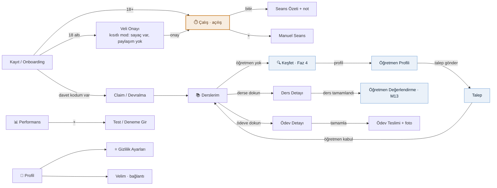
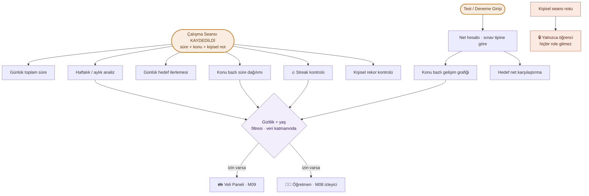
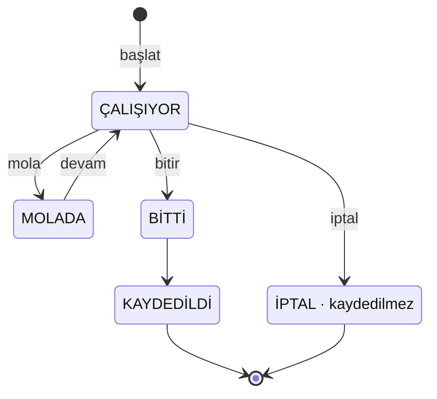
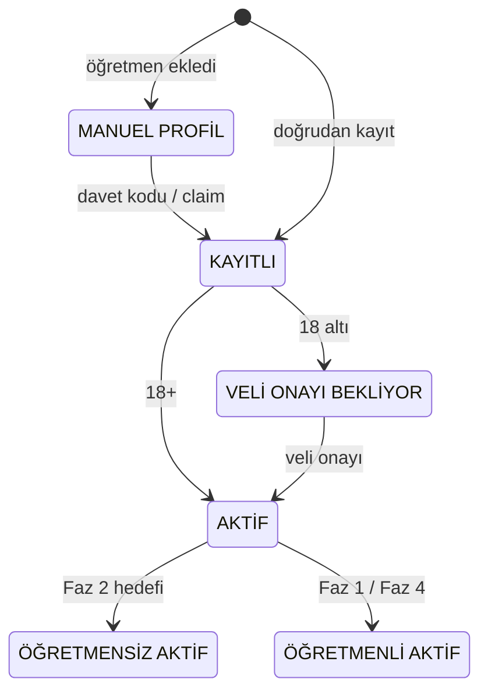
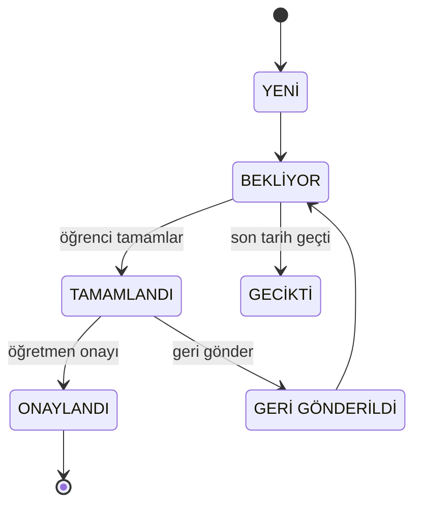

# 🎓 Öğrenci Rolü — Sayfa Mimarisi (Diyagramlar)

> **Referans:** yalnızca [`doc/ogrenci_rolu_fonksiyonel_dokuman_v1.md`](../../ogrenci_rolu_fonksiyonel_dokuman_v1.md) (v1.0).
> Bu şemalar dokümanın **“olması gereken”** tasarımını yansıtır — **mevcut Flutter uygulamasını değil.**
> `[YENİ]` etiketli maddeler dokümandaki önerilerdir (onay bekler).
>
> **Seri:** 1/3 Öğrenci · 2/3 Öğretmen · 3/3 Veli
> **Güncelleme:** 2026-07-19

**Lejant:** 🟢 Free (çekirdek) · 🟣 Premium · ⚠️ *9.2 çelişkisi* (PRD 9.2 → Premium ↔ Böl. 14.3 önerisi → Free) · 🔵 Faz-kapılı · ⭐ kritik/hassas · **[Y]** = [YENİ] öneri

---

## 1. Sayfa Yapısı — Bilgi Mimarisi (IA ağacı)

5 alt sekme. **Açılış ekranı ⏱️ Çalış (Sayaç)**’tır — öğrenci uygulamayı *“bugün ne kadar çalıştım?”* ile açar, *“dersim ne zaman?”* ile değil (Böl. 5, 3.1). Kaynak: **Bölüm 5** ekran haritası.

```mermaid
flowchart TD
  ROOT(["🎓 ÖĞRENCİ UYGULAMASI"])
  ROOT --> T1["⏱️ ÇALIŞ · AÇILIŞ"]
  ROOT --> T2["📊 PERFORMANS"]
  ROOT --> T3["📚 DERSLERİM"]
  ROOT --> T4["🔍 KEŞFET · Faz 4"]
  ROOT --> T5["👤 PROFİL"]

  T1 --> T1a["Büyük sayaç"]
  T1 --> T1b["Konu / ders seçici"]
  T1 --> T1c["Başlat · Mola · Bitir"]
  T1 --> T1d["Bugünkü toplam süre"]
  T1 --> T1e["🔥 Streak göstergesi"]
  T1 --> T1f["Günlük hedef ilerlemesi"]
  T1 --> T1g["+ Manuel seans ekle"]

  T2 --> T2a["Test girişi +"]
  T2a --> T2a1["Konu bazlı test"]
  T2a --> T2a2["Deneme sınavı"]
  T2 --> T2b["Net gelişim grafiği"]
  T2 --> T2c["Hedef net takibi"]
  T2 --> T2d["Haftalık analiz"]
  T2 --> T2e["Aylık analiz"]
  T2 --> T2f["Kişisel rekorlar"]

  T3 --> N["ÖĞRETMEN YOKSA — boş durum"]
  N --> N1["Öğretmen Bul · Faz 4"]
  N --> N2["Davet kodu gir · claim"]
  T3 --> Y["ÖĞRETMEN VARSA"]
  Y --> Y1["Yaklaşan dersler"]
  Y --> Y2["Ders geçmişi"]
  Y --> Y3["Ödevlerim"]
  Y --> Y4["Öğretmen notları · paylaşılan"]
  Y --> Y5["Gelişim değerlendirmem · Faz 3"]

  T4 --> F1["Öğretmen arama"]
  T4 --> F2["Filtre: branş·şehir·ücret·şekil·saat"]
  T4 --> F3["Öğretmen profili"]
  T4 --> F4["Favorilerim"]
  T4 --> F5["Taleplerim"]

  T5 --> P1["Profil bilgileri"]
  T5 --> P2["Velim · bağlantı"]
  T5 --> P3["⭐ Gizlilik ayarları"]
  T5 --> P4["Abonelik · Faz 5"]
  T5 --> P5["Bildirim ayarları"]
  T5 --> P6["Ayarlar & Güvenlik"]

  classDef open fill:#f8ede0,stroke:#c9791f,stroke-width:2px,color:#5a3410,font-weight:700;
  classDef faz fill:#eaf1f9,stroke:#5c93cf,color:#123;
  classDef star fill:#f3eefb,stroke:#6d54b5,color:#33235e;
  class T1 open;
  class T4 faz;
  class P3 star;
```

**Tasarım kuralı:** Sayaç 0 tıkla erişilir; *“Öğretmenim”* / *“Hedefler”* gibi ikincil hedefler ayrı alt sekme değil, ilgili sekme/hub içindedir.

### 1.1 Faz bazlı sekme durumu (Böl. 5.1)

| Sekme | Faz 1 | Faz 2 | Faz 3 | Faz 4 |
|---|---|---|---|---|
| ⏱️ Çalış | ✗ yok | ✅ tam | ✅ | ✅ |
| 📊 Performans | ✗ yok | ◑ temel | ✅ tam | ✅ |
| 📚 Derslerim | ✅ **tek sekme** | ✅ | ✅ | ✅ |
| 🔍 Keşfet | ✗ | ✗ | ✗ | ✅ |
| 👤 Profil | ✅ | ✅ | ✅ | ✅ |

> **Faz 1’de öğrenci uygulaması yalnızca “Derslerim”dir** — öğretmenin uzantısı. **Öğrenci ürünü Faz 2’de doğar.**

---

## 2. Sayfa İçerikleri — İçerik Blok Şeması

Her sekmenin içerdiği bloklar; kaynak yetenek (`S-xx` / modül), faz ve Free/Premium durumu.
**⚠️ işaretli bloklar dokümanın merkezî çelişkisidir (Böl. 16.1):** PRD 9.2 tablosu bunları Free’de kapatır, Bölüm 14.3 önerisi Free’ye açılmasını ister.

### ⏱️ Çalış — *Açılış · Faz 2*

| Blok | Kaynak | Kural / Not | Durum |
|---|---|---|---|
| Büyük sayaç | `S-08.1` | ders/konu seçip başlat | 🟢 Free |
| Başlat · Mola · Bitir | `S-08.2–4` | **mola süresi toplama eklenmez** | 🟢 Free |
| Bugünkü toplam süre | `S-08.20` | — | 🟢 Free |
| 🔥 Streak göstergesi | `S-08.25` | retention motoru | ⚠️ 9.2 |
| Günlük hedef ilerlemesi | `S-08.26` | — | ⚠️ 9.2 |
| + Manuel seans ekle | `S-08.8` **[Y]** | sayaç unutulunca | 🟢 Free |
| Arka plan + offline sayaç | `B-02` **[Y]** | **kritik teknik gereksinim** | 🟢 Free |

### 📊 Performans — *Faz 2–3*

| Blok | Kaynak | Kural / Not | Durum |
|---|---|---|---|
| Test girişi (doğru/yanlış/boş) | `S-08.12` | — | 🟢 Free |
| Net hesabı — sınav tipine göre | `S-08.13/16` **[Y]** | **LGS ≠ TYT formülü** | 🟢 Free |
| Deneme sınavı (çok dersli) | `S-08.17` **[Y]** | — | 🟢 Free |
| Net gelişim grafiği | `S-08.14` | — | ⚠️ 9.2 |
| Hedef net takibi | `S-08.15` | — | ⚠️ 9.2 |
| Haftalık analiz | `S-08.20–23` | Faz 2.4 “Kritik” | ⚠️ 9.2 |
| Aylık analiz | `S-08.24` | — | 🟣 Premium |
| Kişisel rekorlar | `S-08.28` | — | ⚠️ 9.2 |

### 📚 Derslerim — *Faz 1 · iki hâl*

**Öğretmen YOKSA (boş durum):**

| Blok | Kaynak | Not | Durum |
|---|---|---|---|
| “Henüz öğretmenin yok” + Öğretmen Bul | — | Faz 4’te aktif | 🔵 Faz 4 |
| Davet kodum var → devral (claim) | `S-01.2 / B-01` **[Y]** | **kritik** — iki giriş yolunu birleştirir | 🟢 Free |

**Öğretmen VARSA (salt-okunur izleyici):**

| Blok | Kaynak | Not | Durum |
|---|---|---|---|
| Yaklaşan dersler | `S-04.1` | M04 izleyici | 🟢 Free |
| Ders geçmişi | `S-05.1` | M05 izleyici | 🟢 Free |
| Ödevlerim (bekleyen/tamam/geciken) | `S-06.1` | — | 🟢 Free |
| Ödev teslimi — dosya/foto yükle | `S-06.6 / B-06` **[Y]** | ödev modülünü çift yönlü yapar | 🟢 Free |
| Öğretmen notları — **yalnız paylaşılan** | `S-05.3` | özel notu **GÖRMEZ** (`S-03.10`) | 🟢 Free |
| Gelişim değerlendirmem | `S-10.x` | salt-okunur | 🔵 Faz 3 |

### 🔍 Keşfet — *Faz 4*

| Blok | Kaynak | Not | Durum |
|---|---|---|---|
| Öğretmen arama / listeleme | `S-12.1` | — | 🔵 Faz 4 |
| Filtreler | `S-12.2–6` | branş·şehir·ücret·şekil·saat | 🔵 Faz 4 |
| Öğretmen profili | `S-12.7` | puan·yorum·rozet | 🔵 Faz 4 |
| Favorilerim · Taleplerim | `S-12.10/11` **[Y]** | durum takibi | 🔵 Faz 4 |
| Değerlendirme / yorum | `S-13.x` | yalnız ders alınan öğretmene | 🔵 Faz 4 |

### 👤 Profil — *Faz 0+ / 2*

| Blok | Kaynak | Not | Durum |
|---|---|---|---|
| Profil bilgileri | `S-03.x` | sınıf·branş·**hedef sınav [Y]** | 🟢 Free |
| Velim — bağlantı | `S-09.1` | **çoklu veli [Y]** | 🟢 Free |
| ⭐ Gizlilik ayarları — yaş bazlı matris | `S-08.32 / S-15.3 / B-07` | **en hassas ekran** | 🟢 Free |
| Bildirim ayarları | `S-11.7` | — | 🟢 Free |
| Abonelik | `S-15.5` | — | 🔵 Faz 5 |
| Ayarlar & Güvenlik | `S-15.1–4` | şifre·KVKK·hesap kapatma | 🟢 Free |

---

## 3. Sayfalar Arası İlişki + Veri Akışı

### 3a. Gezinme haritası

Onboarding sayaca akıtır (öğretmen sorulmaz). “Öğretmensiz” Derslerim, Keşfet’e köprüdür; Faz 4 kabulü döngüyü kapatır.

### 3b. Veri akışı (Böl. 7 AKIŞ 4, Böl. 11.1)

Her türev veri, dış role çıkmadan önce **veri katmanındaki** gizlilik/yaş filtresinden geçer.
**Değişmez kural:** kişisel seans notu hiçbir yaşta, hiçbir role açılmaz.

### 3c. Durum makineleri (Böl. 11)

**Çalışma seansı** (11.1) — mola süresi toplama eklenmez:

**Hesap durumu** (11.2) — 18 altı onaysız tam aktifleşmez:

**Ödev — öğrenci görünümü** (11.3) — onay/geri-gönderme **[Y]**:

---

**Kaynak bölümler:** Böl. 4 (yetenek matrisi) · 5 (ekran haritası) · 7–10 (akışlar) · 11 (durum makineleri) · 13 (veri modeli) · 14 (Free/Premium) · 16 (boşluk/çelişki).
