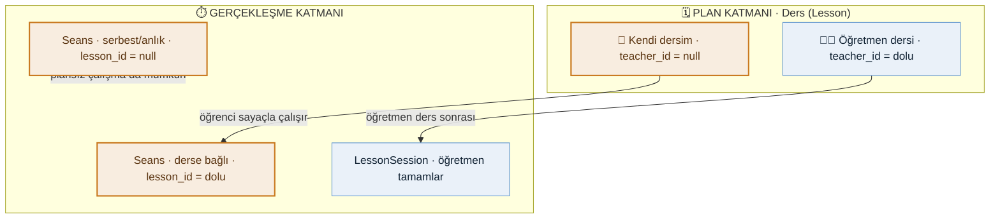
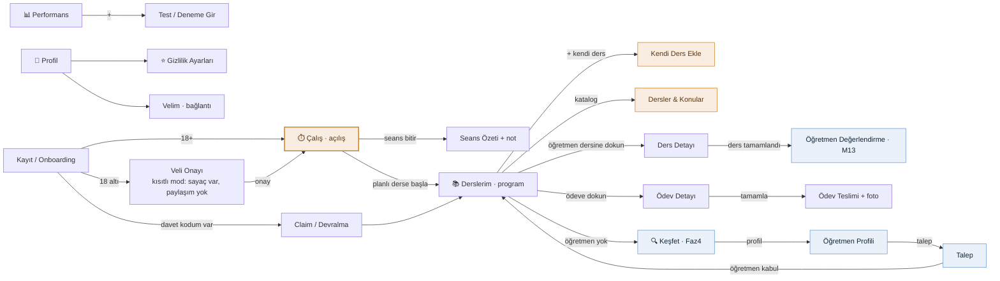
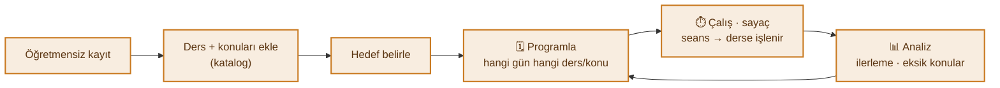
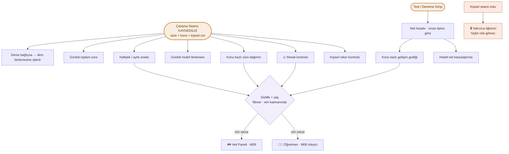
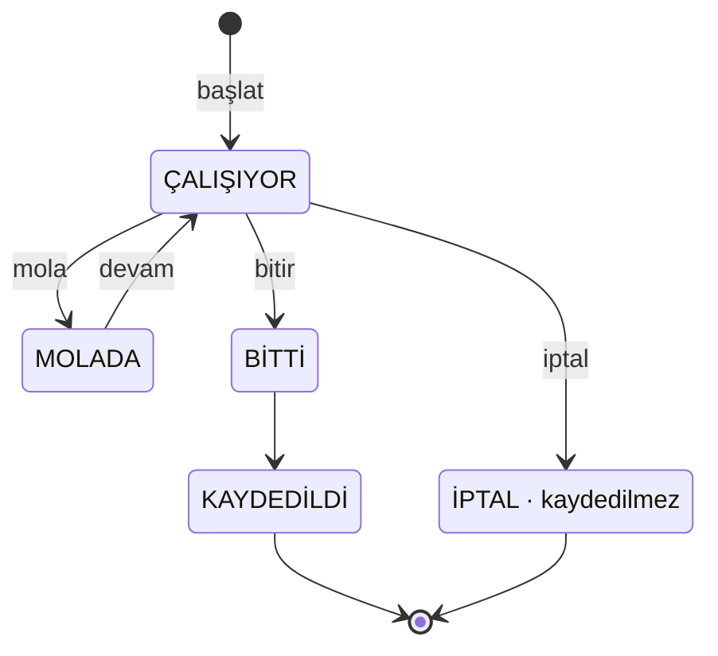
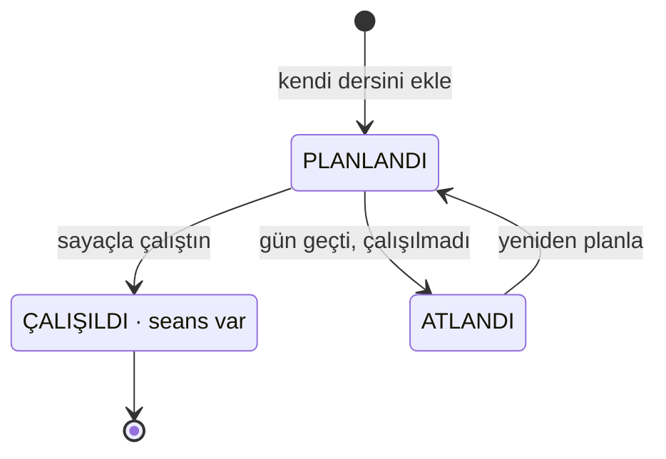
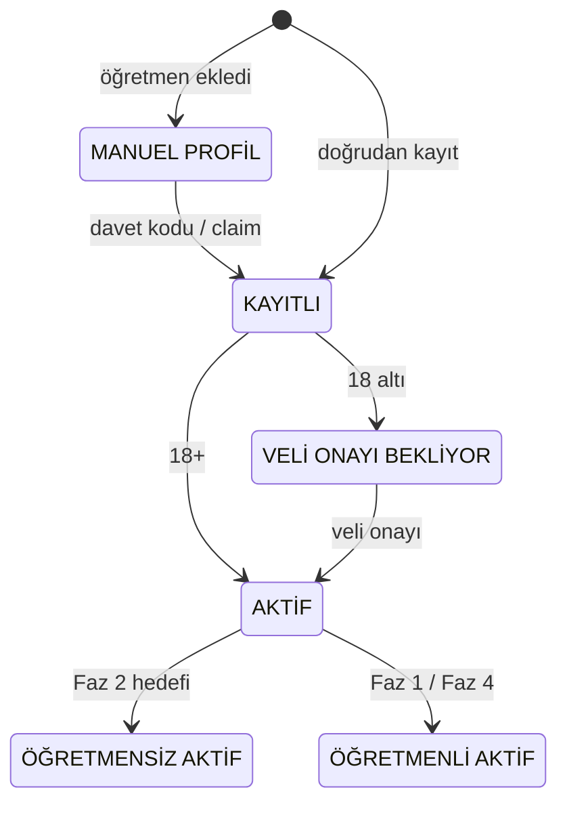
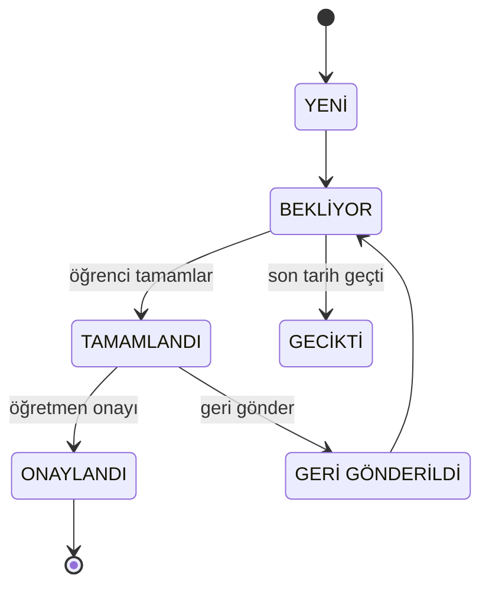

# 🎓 Öğrenci Rolü — Sayfa Mimarisi (Diyagramlar)

> **Referans:** yalnızca [`doc/_arsiv/ogrenci_rolu_fonksiyonel_dokuman_v1.md`](../../_arsiv/ogrenci_rolu_fonksiyonel_dokuman_v1.md) (v1.0, ⚠️ arşiv 2026-08-19 — güncel otorite `doc/roles/ogrenci.md`) + **Ç-06 kararı** (bkz. §1.2).
> Bu şemalar dokümanın **“olması gereken”** tasarımını yansıtır — **mevcut Flutter uygulamasını değil.**
> `[YENİ]` etiketli maddeler dokümandaki önerilerdir (onay bekler).
>
> **Seri:** 1/3 Öğrenci · 2/3 Öğretmen · 3/3 Veli
> **Güncelleme:** 2026-07-19

**Lejant:** 🟢 Free · 🟣 Premium · ⚠️ *9.2 çelişkisi* (PRD 9.2 → Premium ↔ Böl. 14.3 → Free) · 🔵 Faz-kapılı · ⭐ kritik/hassas · 👤 kendi · 👨‍🏫 öğretmen bağlı · **[Y]** = [YENİ] öneri

> **Ç-06 kararı (bu dosyanın getirdiği güncelleme):** Öğrenci **kendi dersini de öğretmen dersi gibi ekleyip planlar** — tek fark öğretmen bağının (`teacher_id`) olmamasıdır. **“Seans” kaldırılmadı;** planın *gerçekleşme* katmanı oldu (bir derse bağlı ya da serbest). Böylece dokümanın **Ç-06 boşluğu** (öğrencinin kendi çalışma programı) kapanır ve *“hangi gün hangi derse/konuya çalışacağım”* senaryosu karşılanır.

---

## 1. Sayfa Yapısı — Bilgi Mimarisi (IA ağacı)

5 alt sekme. **Açılış ekranı ⏱️ Çalış (Sayaç)**’tır (Böl. 5, 3.1). **📚 Derslerim artık öğretmensiz de doludur:** kendi dersleri + (varsa) öğretmen dersleri birlikte, program/takvim olarak.

```mermaid
flowchart TD
  ROOT(["🎓 ÖĞRENCİ UYGULAMASI"])
  ROOT --> T1["⏱️ ÇALIŞ · AÇILIŞ"]
  ROOT --> T2["📊 PERFORMANS"]
  ROOT --> T3["📚 DERSLERİM"]
  ROOT --> T4["🔍 KEŞFET · Faz 4"]
  ROOT --> T5["👤 PROFİL"]

  T1 --> T1a["Büyük sayaç"]
  T1 --> T1b["Planlı dersten VEYA serbest başlat"]
  T1 --> T1c["Başlat · Mola · Bitir"]
  T1 --> T1d["Bugünkü toplam süre"]
  T1 --> T1e["🔥 Streak göstergesi"]
  T1 --> T1f["Günlük hedef ilerlemesi"]
  T1 --> T1g["+ Manuel seans ekle"]

  T2 --> T2a["Test girişi +"]
  T2a --> T2a1["Konu bazlı test"]
  T2a --> T2a2["Deneme sınavı"]
  T2 --> T2b["Net gelişim grafiği"]
  T2 --> T2c["Hedef net takibi"]
  T2 --> T2d["Haftalık analiz"]
  T2 --> T2e["Aylık analiz"]
  T2 --> T2f["Kişisel rekorlar"]

  T3 --> P0["🗓️ Program / Takvim · hangi gün hangi ders"]
  T3 --> P1["👤 Kendi derslerim"]
  P1 --> P1a["+ Kendi ders ekle · ders·konu·tarih·saat·süre"]
  T3 --> P2["📖 Dersler & Konular kataloğu"]
  T3 --> P3["👨‍🏫 Öğretmen dersleri · varsa"]
  P3 --> P3a["Yaklaşan / geçmiş"]
  P3 --> P3b["Ödevlerim"]
  P3 --> P3c["Öğretmen notları · paylaşılan"]
  P3 --> P3d["Gelişim değerlendirmem · Faz 3"]
  T3 --> P4["Öğretmen yoksa: Öğretmen Bul · Faz 4 · davet kodu"]

  T4 --> F1["Öğretmen arama"]
  T4 --> F2["Filtre: branş·şehir·ücret·şekil·saat"]
  T4 --> F3["Öğretmen profili"]
  T4 --> F4["Favorilerim · Taleplerim"]

  T5 --> Q1["Profil bilgileri"]
  T5 --> Q2["Velim · bağlantı"]
  T5 --> Q3["⭐ Gizlilik ayarları"]
  T5 --> Q4["Abonelik · Faz 5"]
  T5 --> Q5["Bildirim ayarları"]
  T5 --> Q6["Ayarlar & Güvenlik"]

  classDef open fill:#f8ede0,stroke:#c9791f,stroke-width:2px,color:#5a3410,font-weight:700;
  classDef self fill:#f8ede0,stroke:#c9791f,color:#5a3410;
  classDef teach fill:#eaf1f9,stroke:#5c93cf,color:#123;
  classDef star fill:#f3eefb,stroke:#6d54b5,color:#33235e;
  class T1 open;
  class P1,P1a self;
  class P3,P3a,P3b,P3c,P3d teach;
  class T4 teach;
  class Q3 star;
```



**Tasarım kuralı:** Açılış = Sayaç (0 tık). **Derslerim öğretmensiz de anlamlıdır** — kendi derslerini planlarsın; öğretmen bağlanınca aynı görünüme öğretmen dersleri de düşer (rozetle ayrışır).

### 1.1 Faz bazlı sekme durumu (Böl. 5.1 + Ç-06 kararı)

| Sekme | Faz 1 | Faz 2 | Faz 3 | Faz 4 |
|---|---|---|---|---|
| ⏱️ Çalış | ✗ yok | ✅ tam | ✅ | ✅ |
| 📊 Performans | ✗ yok | ◑ temel | ✅ tam | ✅ |
| 📚 Derslerim | ✅ öğretmen dersleri | ✅ **+ kendi dersler/plan** | ✅ | ✅ |
| 🔍 Keşfet | ✗ | ✗ | ✗ | ✅ |
| 👤 Profil | ✅ | ✅ | ✅ | ✅ |

> **Faz 1:** Derslerim yalnız öğretmen dersleri (öğrenci izleyici). **Faz 2:** öğrenci ürünü doğar — **kendi ders/plan** eklenir, öğretmensiz de dolu.

### 1.2 Kavramsal model — Ders (plan) + Seans (gerçekleşme)

İki **ortogonal** katman. Tek fark, dersin **öğretmen bağı** olup olmaması (`teacher_id`).



**Veri modeline etki** — fiziksel model (kodda uygulanmış, Ç-06): öğrencinin kendi dersi ayrı bir
`StudyScheduleEntry` değil; **tek `LessonSchedule` entity**'sinde `TeacherUserId` null olarak tutulur
(eski `study_schedule_entries` tablosu `lesson_schedules`'e göç edip kaldırıldı):

```
LessonSchedule            (Scheduling modülü — tek entity)
  ├─ TeacherUserId  Guid? NULLABLE   ← null = öğrencinin kendi dersi
  ├─ StudentId      required
  ├─ Subject, Topic?, Start/End, TimeZone, RecurrenceRule?, Status, ColorHex?
  └─ (öğretmenliyse) LessonFormat, LocationLabel, MeetingUrl
StudySession (Study modülü)
  └─ LessonId       Guid? NULLABLE   ← derse bağlı ya da serbest
CalendarOccurrence  (okuma modeli) → source = TeacherUserId is null ? "Self" : "Teacher";
                     completed = o gün derse bağlı tamamlanmış seans var mı (planla→çalış→✓)
```

---

## 2. Sayfa İçerikleri — İçerik Blok Şeması

Her sekmenin içerdiği bloklar; kaynak yetenek (`S-xx` / modül), faz ve Free/Premium durumu.
**⚠️ işaretli bloklar dokümanın merkezî çelişkisidir (Böl. 16.1):** PRD 9.2 tablosu bunları Free’de kapatır, Bölüm 14.3 önerisi Free’ye açılmasını ister.

### ⏱️ Çalış — *Açılış · Faz 2*

| Blok | Kaynak | Kural / Not | Durum |
|---|---|---|---|
| Büyük sayaç | `S-08.1` | **planlı dersten** ya da **serbest** başlat | 🟢 Free |
| Başlat · Mola · Bitir | `S-08.2–4` | **mola süresi toplama eklenmez** | 🟢 Free |
| Seans → derse işlenir | Ç-06 | planlı derse başladıysan `lesson_id` dolu | 🟢 Free |
| Bugünkü toplam süre | `S-08.20` | — | 🟢 Free |
| 🔥 Streak göstergesi | `S-08.25` | 9.2: Premium ↔ 14.3: Free | ⚠️ 9.2 |
| Günlük hedef ilerlemesi | `S-08.26` | — | ⚠️ 9.2 |
| + Manuel seans ekle | `S-08.8` **[Y]** | — | 🟢 Free |
| Arka plan + offline sayaç | `B-02` **[Y]** | **kritik teknik gereksinim** | 🟢 Free |

### 📊 Performans — *Faz 2–3*

| Blok | Kaynak | Kural / Not | Durum |
|---|---|---|---|
| Test girişi (doğru/yanlış/boş) | `S-08.12` | — | 🟢 Free |
| Net hesabı — sınav tipine göre | `S-08.13/16` **[Y]** | **LGS ≠ TYT formülü** | 🟢 Free |
| Deneme sınavı (çok dersli) | `S-08.17` **[Y]** | — | 🟢 Free |
| Net gelişim grafiği | `S-08.14` | — | ⚠️ 9.2 |
| Hedef net takibi | `S-08.15` | — | ⚠️ 9.2 |
| Haftalık analiz | `S-08.20–23` | Faz 2.4 “Kritik” | ⚠️ 9.2 |
| Aylık analiz | `S-08.24` | — | 🟣 Premium |
| Kişisel rekorlar | `S-08.28` | — | ⚠️ 9.2 |

### 📚 Derslerim — *Faz 1 (öğretmen) → Faz 2 (kendi) · Ç-06 modeli*

| Blok | Kaynak | Kural / Not | Durum |
|---|---|---|---|
| 🗓️ Program / Takvim | `S-04.6` (Ç-06) | **hangi gün hangi ders/konu** · kendi + öğretmen | 🟢 Free |
| 👤 + Kendi ders ekle | Ç-06 **[Y]** | öğretmen dersi gibi: ders·konu·tarih·saat·süre · `teacher_id=null` | 🟢 Free |
| 📖 Dersler & Konular kataloğu | Ç-06 **[Y]** | çalışılan ders/konuları yönet | 🟢 Free |
| Ders kartı rozeti + filtre | Ç-06 | `👤 Kendi` / `👨‍🏫 Öğretmen` · Tümü/Kendi/Öğretmen | 🟢 Free |
| 👨‍🏫 Yaklaşan / geçmiş dersler | `S-04.1 / S-05.1` | öğretmen dersleri · salt-okunur | 🟢 Free |
| 👨‍🏫 Ödevlerim + teslim (foto) | `S-06.1 / S-06.6` **[Y]** | yalnız öğretmenli derslerde | 🟢 Free |
| 👨‍🏫 Öğretmen notları | `S-05.3` | yalnız paylaşılan (özel notu görmez) | 🟢 Free |
| 👨‍🏫 Gelişim değerlendirmem | `S-10.x` | salt-okunur | 🔵 Faz 3 |
| Öğretmen yoksa: Öğretmen Bul / davet | `S-01.2 / B-01` **[Y]** | boş durum değil — ikincil eylem | 🔵 Faz 4 / claim |

### 🔍 Keşfet — *Faz 4*

| Blok | Kaynak | Not | Durum |
|---|---|---|---|
| Öğretmen arama / listeleme | `S-12.1` | — | 🔵 Faz 4 |
| Filtreler | `S-12.2–6` | branş·şehir·ücret·şekil·saat | 🔵 Faz 4 |
| Öğretmen profili | `S-12.7` | puan·yorum·rozet | 🔵 Faz 4 |
| Favorilerim · Taleplerim | `S-12.10/11` **[Y]** | durum takibi | 🔵 Faz 4 |
| Değerlendirme / yorum | `S-13.x` | yalnız ders alınan öğretmene | 🔵 Faz 4 |

### 👤 Profil — *Faz 0+ / 2*

| Blok | Kaynak | Not | Durum |
|---|---|---|---|
| Profil bilgileri | `S-03.x` | sınıf·branş·**hedef sınav [Y]** | 🟢 Free |
| Velim — bağlantı | `S-09.1` | **çoklu veli [Y]** | 🟢 Free |
| ⭐ Gizlilik ayarları — yaş bazlı matris | `S-08.32 / S-15.3 / B-07` | **en hassas ekran** | 🟢 Free |
| Bildirim ayarları | `S-11.7` | — | 🟢 Free |
| Abonelik | `S-15.5` | — | 🔵 Faz 5 |
| Ayarlar & Güvenlik | `S-15.1–4` | şifre·KVKK·hesap kapatma | 🟢 Free |

---

## 3. Sayfalar Arası İlişki + Veri Akışı

### 3a. Gezinme haritası

Onboarding sayaca akıtır (öğretmen sorulmaz). Derslerim öğretmensiz de doludur (kendi dersler); Faz 4 kabulüyle öğretmen dersleri eklenir.



### 3b. Öğretmensiz çalışma döngüsü (Ç-06 senaryosu)

Öğretmene hiç ihtiyaç duymadan tam döngü — kayıt → planla → çalış → analiz → yeniden planla.



### 3c. Veri akışı — seans kaydı (Böl. 7 AKIŞ 4, Böl. 11.1)

Her türev veri, dış role çıkmadan önce **veri katmanındaki** gizlilik/yaş filtresinden geçer.
**Değişmez kural:** kişisel seans notu hiçbir yaşta, hiçbir role açılmaz.



### 3d. Durum makineleri

**Çalışma seansı** (Böl. 11.1) — mola süresi toplama eklenmez:



**Kendi dersi (plan)** — Ç-06 · öğretmen dersinin öğretmensiz karşılığı:



**Hesap durumu** (Böl. 11.2) — 18 altı onaysız tam aktifleşmez:



**Ödev — öğrenci görünümü** (Böl. 11.3) — onay/geri-gönderme **[Y]**:



---

**Kaynak bölümler:** Böl. 4 (yetenek matrisi) · 5 (ekran haritası) · 7–10 (akışlar) · 11 (durum makineleri) · 13 (veri modeli · Ç-06 ile revize) · 14 (Free/Premium) · 16 (boşluk/çelişki · Ç-06).
