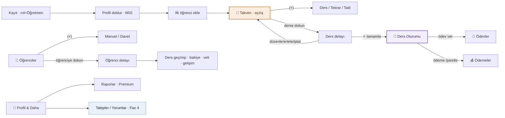
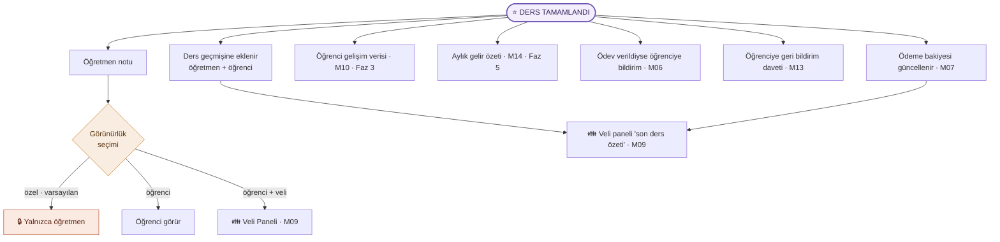
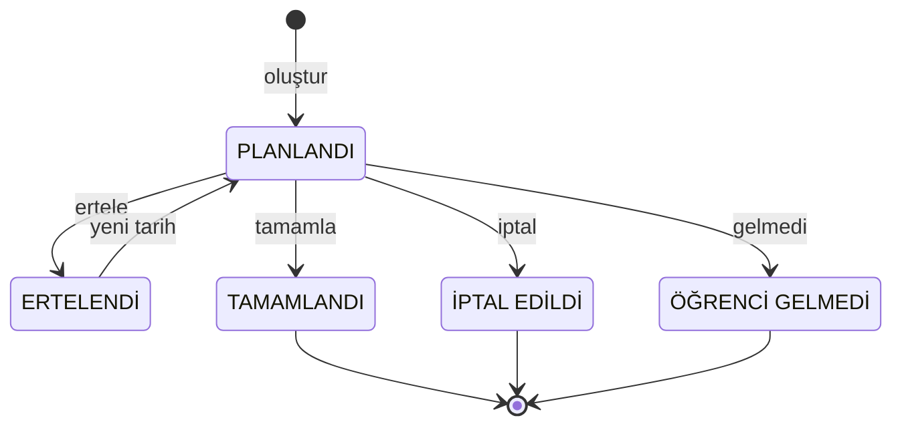
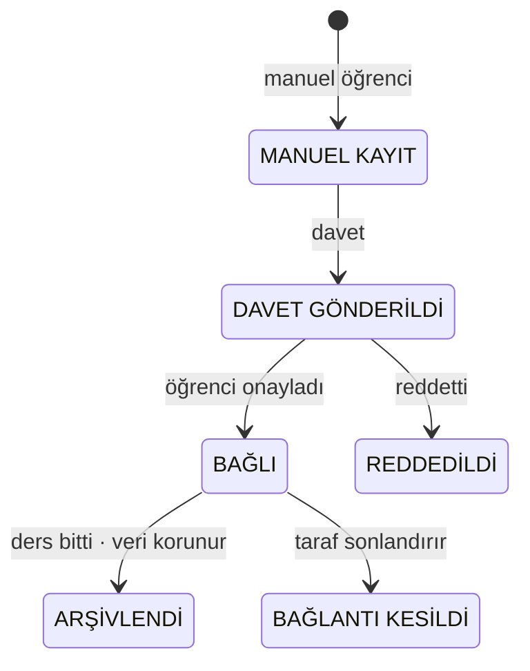
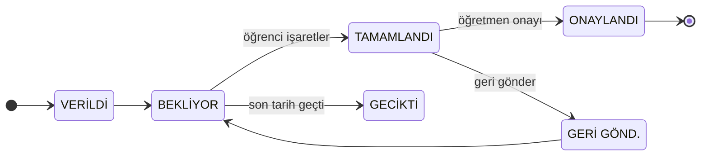
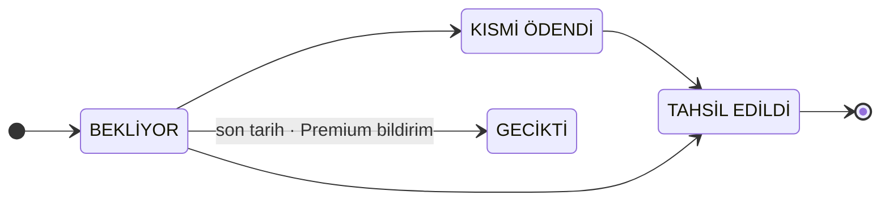

# 👨‍🏫 Öğretmen Rolü — Sayfa Mimarisi (Diyagramlar)

> **Referans:** yalnızca [`doc/_arsiv/ogretmen_rolu_fonksiyonel_dokuman_v1.md`](../../_arsiv/ogretmen_rolu_fonksiyonel_dokuman_v1.md) (v1.0, ⚠️ arşiv 2026-08-19 — güncel otorite `doc/roles/ogretmen.md`).
> Bu şemalar dokümanın **“olması gereken”** tasarımını yansıtır — **mevcut Flutter uygulamasını değil.**
> `[YENİ]` etiketli maddeler dokümandaki önerilerdir (onay bekler).
>
> **Seri:** 1/3 Öğrenci · **2/3 Öğretmen** · 3/3 Veli
> **Güncelleme:** 2026-07-19

**Lejant:** 🟢 Free · 🟣 Premium · ⚠️ *çelişki* (M07 temel özellik ↔ 9.1 tablosu Premium) · 🔵 Faz-kapılı · ⭐ ürünün kalbi · **[Y]** = [YENİ] öneri

> **Rolün tezi (Böl. 1.1):** Öğretmen bu ürüne **öğrenci bulmak için değil, derslerini yönetmek için** her gün girer. Eşleştirme (M12) Faz 4’e kadar açılmaz. Bu yüzden **açılış ekranı Takvim’dir.**

---

## 1. Sayfa Yapısı — Bilgi Mimarisi (IA ağacı)

5 alt sekme. **Açılış ekranı 📅 Takvim / bugün**’dür (Böl. 5 tasarım kuralı). Ürünün kalbi, Takvim → *Dersi Tamamla* → **Ders Oturumu** akışıdır (< 60 sn).

```mermaid
flowchart TD
  ROOT(["👨‍🏫 ÖĞRETMEN UYGULAMASI"])
  ROOT --> T1["📅 TAKVİM · AÇILIŞ"]
  ROOT --> T2["👥 ÖĞRENCİLER"]
  ROOT --> T3["📝 ÖDEVLER"]
  ROOT --> T4["💰 ÖDEMELER"]
  ROOT --> T5["👤 PROFİL & DAHA"]

  %% TAKVİM
  T1 --> C1["Günlük görünüm · varsayılan"]
  T1 --> C2["Haftalık görünüm"]
  T1 --> C3["Aylık görünüm"]
  T1 --> CE["(+) Ekle"]
  CE --> CE1["Tek seferlik ders"]
  CE --> CE2["Tekrar eden ders"]
  CE --> CE3["Tatil / Müsait Değil"]
  T1 --> CD["Ders detayı"]
  CD --> CD1["Düzenle"]
  CD --> CD2["Ertele"]
  CD --> CD3["İptal Et"]
  CD --> CD4["⭐ Dersi Tamamla"]
  CD4 --> DO["🎯 Ders Oturumu · M05<br/>katılım·konu·süre·not·ödev·ödeme"]

  %% ÖĞRENCİLER
  T2 --> S1["Liste · aktif / arşiv"]
  T2 --> S2["(+) Öğrenci Ekle"]
  S2 --> S2a["Manuel oluştur"]
  S2 --> S2b["Kayıtlı öğrenciyi davet et"]
  T2 --> S3["Öğrenci detayı"]
  S3 --> S3a["Profil · ders geçmişi · ödev"]
  S3 --> S3b["Gelişim · Faz 3"]
  S3 --> S3c["Bireysel çalışma · Faz 2 · izinli"]
  S3 --> S3d["Ödeme/bakiye · veli · özel not"]

  %% ÖDEVLER
  T3 --> H1["Bekleyen"]
  T3 --> H2["Tamamlananlar"]
  T3 --> H3["Gecikenler"]
  T3 --> H4["(+) Ödev Ver"]

  %% ÖDEMELER
  T4 --> P1["Bu ay özeti"]
  T4 --> P2["Öğrenci bazlı bakiye"]
  T4 --> P3["Geciken ödemeler · Premium"]
  T4 --> P4["Ödeme işaretleme"]

  %% PROFİL
  T5 --> R1["Öğretmen profili · M02"]
  T5 --> R2["Raporlar · M14 · Premium"]
  T5 --> R3["Gelen talepler · Faz 4"]
  T5 --> R4["Yorumlarım · Faz 4"]
  T5 --> R5["Abonelik · Faz 5"]
  T5 --> R6["Bildirim ayarları"]
  T5 --> R7["Ayarlar & Güvenlik · M15"]

  classDef open fill:#f8ede0,stroke:#c9791f,stroke-width:2px,color:#5a3410,font-weight:700;
  classDef heart fill:#f3eefb,stroke:#6d54b5,stroke-width:2px,color:#33235e;
  classDef faz fill:#eaf1f9,stroke:#5c93cf,color:#123;
  class T1 open;
  class CD4,DO heart;
  class R3,R4 faz;
```

**Tasarım kuralı:** Uygulama açılışında öğretmen **Takvim/bugün** ekranını görür — PRD’nin *“günlük çalışma aracı”* tezinin doğrudan karşılığı.

### 1.1 Faz bazlı olgunluk (türetilmiş — Böl. 2 + 16)

| Sekme / yetenek | Faz 1 | Faz 2 | Faz 3 | Faz 4 | Faz 5 |
|---|---|---|---|---|---|
| 📅 Takvim (ders/tekrar/tatil/oturum) | ✅ tam | ✅ | ✅ | ✅ | ✅ |
| 👥 Öğrenciler — manuel | ✅ | ✅ | ✅ | ✅ | ✅ |
| 👥 Öğrenci **davet/bağlanma** | — | ✅ | ✅ | ✅ | ✅ |
| 👥 Öğrenci **gelişim/bireysel** | — | ◑ izin | ✅ | ✅ | ✅ |
| 📝 Ödevler | ✅ | ✅ | ✅ | ✅ | ✅ |
| 💰 Ödemeler — temel | ✅ | ✅ | ✅ tam | ✅ | ✅ |
| 💰 Gelir analizi/geciken | — | — | ◑ | — | ✅ Premium |
| 👤 Raporlar (M14) | — | — | — | — | ✅ Premium |
| 👤 Talepler / Yorumlar | — | — | — | ✅ | ✅ |

> **Faz 1’de hazır olması gereken:** Profil · Öğrenci ekleme · Takvim · Ders oturumu · Not/ödev · Basit ödeme (Böl. 16 & 18).

---

## 2. Sayfa İçerikleri — İçerik Blok Şeması

Her sekmenin blokları; kaynak yetenek (`T-xx` / modül), faz ve Free/Premium durumu.
**⚠️ işaretli bloklar dokümanın çelişkisidir (Böl. 15.2):** M07/M14’te temel yazılıp 9.1 tablosunda Premium’a kapatılan gelir özellikleri.

### 📅 Takvim — *Açılış · Faz 1*

| Blok | Kaynak | Kural / Not | Durum |
|---|---|---|---|
| Günlük görünüm (bugünün dersleri) | `T-04.9` **[Y]** | **varsayılan açılış** | 🟢 Free |
| Haftalık görünüm | `T-04.5` | 7 gün × saat ızgarası | 🟢 Free |
| Aylık görünüm | `T-04.6` | gün başına ders + tatil | 🟢 Free |
| (+) Tek seferlik ders | `T-04.1` | çakışma kontrolü (`T-04.7`) | 🟢 Free |
| (+) Tekrar eden ders | `T-04.4` | desen + bitiş koşulu | 🟢 Free |
| (+) Tatil / Müsait Değil bloğu | `T-04.11` **[Y]** | çakışan dersleri toplu yönet | 🟢 Free |
| Ders detayı → Düzenle | `T-04.2` | tekrar eden: **kapsam sorusu** (bu/bu+sonraki/tümü) **[Y]** | 🟢 Free |
| Ders detayı → Ertele | `T-04.10` **[Y]** | aynı dersin taşınması; bildirim gider | 🟢 Free |
| Ders detayı → İptal / Sil | `T-04.3` | iptal ≠ silme (24 saat kuralı) | 🟢 Free |
| Ders yeri / online link | `T-04.14` **[Y]** | — | 🟢 Free |
| Boş zaman analizi | `T-04.15` | — | 🟣 Premium |

### 🎯 Ders Oturumu — *Takvim → Dersi Tamamla · Faz 1 · ÜRÜNÜN KALBİ*

> Akış **< 60 sn** olmalı; tek zorunlu alan **katılım durumu**dur (AKIŞ 11).

| Blok | Kaynak | Kural / Not | Durum |
|---|---|---|---|
| Katılım durumu (geldi/gelmedi/geç) | `T-05.7` | **tek zorunlu alan** | 🟢 Free |
| İşlenen konu | `T-05.3` | son konular önerilir | 🟢 Free |
| Gerçekleşen süre | `T-05.10` **[Y]** | planlanan ön-dolu | 🟢 Free |
| İşlenen içerik | `T-05.4` | serbest metin | 🟢 Free |
| Öğretmen notu + **görünürlük** | `T-05.6` / **[Y]** | özel / öğrenci / öğrenci+veli · **varsayılan özel** | 🟢 Free |
| Ödev ver → dallanır | `T-05.8` | Ödevler akışına | 🟢 Free |
| Ödeme durumu işaretle | `T-07.2` | tahsil / bekliyor / kısmi | 🟢 Free |
| Öğrenci gelmedi → ücret kararı | `T-05.11` **[Y]** | — | 🟢 Free |

### 👥 Öğrenciler — *Faz 1*

| Blok | Kaynak | Kural / Not | Durum |
|---|---|---|---|
| Öğrenci listesi (aktif / arşiv) | `T-03.11` | — | 🟢 Free |
| (+) Manuel öğrenci ekle | `T-03.1–10` | **öğrenci uygulamada olmadan** çalışır | 🟢 Free |
| (+) Kayıtlı öğrenciyi davet et | `T-03.15` **[Y]** | davet kodu / eşleşme | 🔵 Faz 2 |
| Öğrenci arşivleme | `T-03.14` **[Y]** | Free limitiyle bağlantılı | 🟢 Free |
| Detay: ders geçmişi | `T-05.9` | — | 🟢 Free |
| Detay: bireysel çalışma verisi | `T-08.1–4` | **salt-okunur · izin bazlı** | 🔵 Faz 2 |
| Detay: gelişim/performans | `T-10.x` | — | 🔵 Faz 3 |
| Detay: ödeme/bakiye | `T-07.5` | — | 🟢 Free |
| Detay: veli bilgisi · özel not | `T-03.7/8` | özel not öğrenciye **görünmez** | 🟢 Free |
| Öğrenci bazlı ücret / aylık paket | `T-07.10` **[Y]** / `T-07`  | profili ezer | 🟢 Free |
| Free limit (5–10 aktif) | `T-03.16` | dolunca yükseltme yönlendirmesi | 🟢 Free |

### 📝 Ödevler — *Faz 1*

| Blok | Kaynak | Kural / Not | Durum |
|---|---|---|---|
| Bekleyen / Tamamlanan / Geciken | `T-06.4` | durum takibi | 🟢 Free |
| (+) Ödev Ver | `T-06.2/3/5` | başlık·açıklama·son tarih·dosya | 🟢 Free |
| Ödev onayla / geri gönder | `T-06.7` **[Y]** | — | 🟢 Free |
| Ödeve geri bildirim | `T-06.8` **[Y]** | — | 🟢 Free |
| Aynı ödevi çoklu öğrenciye | `T-06.9` **[Y]** | — | 🔵 Faz 3 |

### 💰 Ödemeler — *Faz 1 · “platform üzerinden tahsilat YOK” (`T-07.9`)*

| Blok | Kaynak | Kural / Not | Durum |
|---|---|---|---|
| Öğrenci bazlı bakiye listesi | `T-07.5` | — | 🟢 Free |
| Ödeme işaretleme (tahsil/bekliyor/kısmi) | `T-07.2–4` | veli paneline yansır | 🟢 Free |
| Bu ay / aylık gelir özeti | `T-07.6` | M07 temel ↔ 9.1 Premium (Ç-01) | ⚠️ |
| Geciken ödemeler | `T-07.7` | — | 🟣 Premium |
| Otomatik ödeme hesaplama / gelir analizi | `T-07.8` | — | 🟣 Premium |
| Ödeme geçmişi | `T-07.11` **[Y]** | kim/ne zaman/ne kadar | 🔵 Faz 3 |

### 👤 Profil & Daha Fazlası — *Faz 0+*

| Blok | Kaynak | Kural / Not | Durum |
|---|---|---|---|
| Öğretmen profili | `T-02.1–13` | branş·şehir·ücret·müsaitlik·sertifika·foto·doğrulama | 🟢 Free |
| Raporlar (ders/gelir/boş zaman/PDF/performans) | `T-14.1–5` | — | 🟣 Premium |
| Eşleştirmede görün + Gelen talepler | `T-12.1/4` · **[Y]** | görünürlük anahtarı | 🔵 Faz 4 |
| Yorumlarım (yanıt verme) | `T-13.5` | olumsuz yorum **silinemez/gizlenemez** | 🔵 Faz 4 |
| Abonelik | `T-15.5` | — | 🔵 Faz 5 |
| Bildirim ayarları | `T-11.7` | ⚠️ hatırlatma çelişkisi (Ç-02) | 🟢 Free |
| Ayarlar & Güvenlik | `T-15.1–4` | şifre·gizlilik·KVKK·hesap kapatma | 🟢 Free |

---

## 3. Sayfalar Arası İlişki + Veri Akışı

### 3a. Gezinme haritası

Onboarding takvime akıtır; **eşleştirmeden hiç bahsedilmez** (Faz 4’e kadar yok). Vaat: *“derslerini yönet”*.

### 3b. Veri akışı — “Ders Tamamlandı” dağılımı (AKIŞ 11 · adım 12)

Ders tamamlama tek noktadan **7 hedefe** veri dağıtır; öğretmen notu **görünürlük filtresinden** geçer.

### 3c. Durum makineleri (Böl. 12)

**Ders durumu** (12.1):

> TAMAMLANDI’da tarih değiştirilemez (yalnız not/konu). Sil: 24 saat + gelecek ders.

**Bağlantı durumu** (12.4):

**Ödev durumu** (12.2) &nbsp;·&nbsp; **Ödeme durumu** (12.3):

---

**Kaynak bölümler:** Böl. 4 (yetenek matrisi) · 5 (ekran haritası) · 6–11 (akışlar) · 12 (durum makineleri) · 14 (veri modeli) · 15 (boşluk/çelişki) · 16 (yol haritası).
