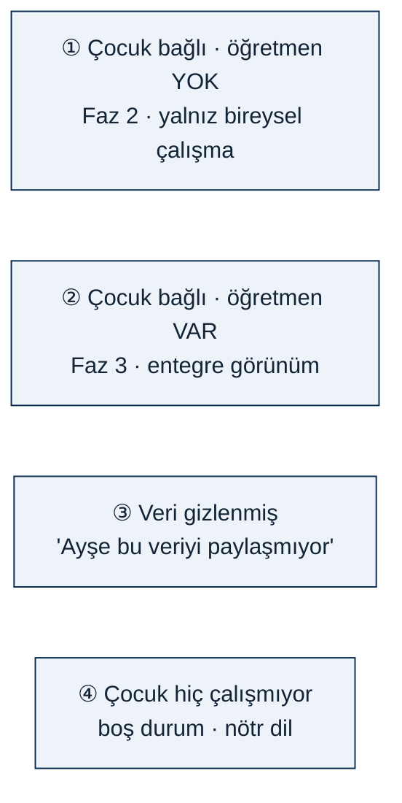
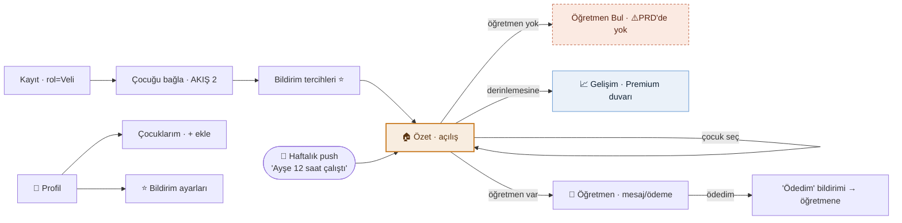
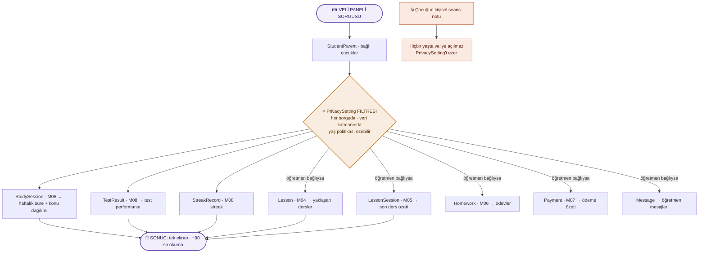
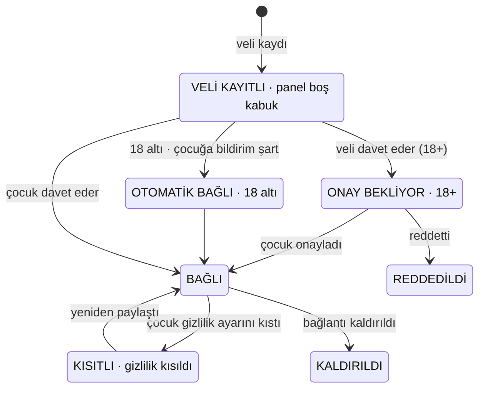

# 👪 Veli Rolü — Sayfa Mimarisi (Diyagramlar)

> **Referans:** yalnızca [`doc/veli_rolu_fonksiyonel_dokuman_v1.md`](../../veli_rolu_fonksiyonel_dokuman_v1.md) (v1.0).
> Bu şemalar dokümanın **“olması gereken”** tasarımını yansıtır — **mevcut Flutter uygulamasını değil.**
> `[YENİ]` etiketli maddeler dokümandaki önerilerdir (onay bekler).
>
> **Seri:** 1/3 Öğrenci · 2/3 Öğretmen · **3/3 Veli**
> **Güncelleme:** 2026-07-19

**Lejant:** 🟢 Free · 🟣 Premium · ⚠️ *çelişki/boşluk* · 🔵 Faz-kapılı · ⭐ retention kritik · 🔒 mahremiyet çekirdeği · **[Y]** = [YENİ] öneri

> **Rolün tezi (Böl. 1):** Veli, **en düşük yetkiye ama en yüksek ekonomik güce** sahip roldür — üç rol içinde neredeyse hiçbir şey *yapamaz* ama premium paketlerin parasını fiilen o öder. **Kendi verisi yoktur;** panel, öğrenci verisinin bir **görüntüleme katmanıdır** (teknik olarak bir dashboard). Uygulaması bilinçli olarak **sığdır** — veli haftada ~2 kez, 90 saniye kullanır.

---

## 1. Sayfa Yapısı — Bilgi Mimarisi (IA ağacı)

4 alt sekme. **Açılış ekranı 🏠 Özet**’tir — PRD M09’un 5 “temel görünümü” tek ekranın 5 kartıdır (Böl. 5, AKIŞ 5). Derin navigasyon burada düşmandır.

```mermaid
flowchart TD
  ROOT(["👪 VELİ UYGULAMASI"])
  ROOT --> T1["🏠 ÖZET · AÇILIŞ"]
  ROOT --> T2["📈 GELİŞİM · Faz 3"]
  ROOT --> T3["💬 ÖĞRETMEN · öğretmen varsa"]
  ROOT --> T4["👤 PROFİL"]

  %% ÖZET
  T1 --> C0["Çocuk seçici · çoklu çocuk"]
  T1 --> C1["⏱️ Bu hafta: süre + değişim + 🔥streak"]
  T1 --> C2["📊 Ders dağılımı grafiği"]
  T1 --> C3["📈 Test performansı özeti"]
  T1 --> N["ÖĞRETMEN YOKSA"]
  N --> N1["Öğretmen Bul"]
  T1 --> Y["ÖĞRETMEN VARSA"]
  Y --> Y1["Yaklaşan ders"]
  Y --> Y2["Son ders özeti"]
  Y --> Y3["Bekleyen ödevler"]
  Y --> Y4["Öğretmen mesajı"]
  Y --> Y5["Ödeme durumu"]

  %% GELİŞİM
  T2 --> G1["Detaylı grafikler · Premium"]
  T2 --> G2["Konu kazanımları"]
  T2 --> G3["Eksik / güçlü konular"]
  T2 --> G4["Hedef vs gerçekleşen"]
  T2 --> G5["Çalışma geçmişi · Premium"]
  T2 --> G6["Öğretmen değerlendirmeleri"]

  %% ÖĞRETMEN
  T3 --> M1["Mesajlar"]
  T3 --> M2["Öğretmen profili"]
  T3 --> M3["Ödeme özeti"]

  %% PROFİL
  T4 --> P1["Çocuklarım · + ekle"]
  T4 --> P2["⭐ Bildirim ayarları"]
  T4 --> P3["Abonelik · Faz 5"]
  T4 --> P4["Ayarlar & Güvenlik"]

  classDef open fill:#f8ede0,stroke:#c9791f,stroke-width:2px,color:#5a3410,font-weight:700;
  classDef faz fill:#eaf1f9,stroke:#5c93cf,color:#123;
  classDef warn fill:#fbeae2,stroke:#bb5836,stroke-width:2px,color:#5a2413,stroke-dasharray:4 3;
  classDef star fill:#f3eefb,stroke:#6d54b5,color:#33235e;
  class T1 open;
  class T2 faz;
  class N1 warn;
  class P2 star;
```

> ⚠️ **“Öğretmen Bul” kutusu PRD’de YOK** (Böl. 15.2): M12’nin birincil kullanıcısı *“Öğrenci / Öğretmen”* — veli eşleştirmede tanımsız. Ama parayı veli öder ve *“özellikle küçük yaş gruplarında”* öğretmeni veli seçer. Bu, dokümanın 2 numaralı bulgusudur.

### 1.1 Faz bazlı panel durumu (Böl. 5.1)

| Bölüm | Faz 2 | Faz 3 | Faz 4 | Faz 5 |
|---|---|---|---|---|
| Bireysel çalışma özeti | ✅ **[PRD 2.9]** | ✅ | ✅ | ✅ |
| Öğretmen verileri | ✗ | ✅ **[PRD 3.1]** | ✅ | ✅ |
| Bildirimler | tercihler | ✅ | ✅ | ✅ WhatsApp |
| Gelişim grafikleri | ✗ | ✅ | ✅ | ✅ |
| Öğretmen bulma | ✗ | ✗ | ⚠️ PRD’de yok | — |
| Premium | ✗ | ✗ | ✗ | ✅ |

> **İki veri kaynağı iki ayrı fazda açılır:** Faz 2 panel tek kaynaklıdır (yalnız bireysel çalışma), Faz 3’te öğretmen verisi eklenir — **Premium’un asıl vaadi bu birleşmedir.**

### 1.2 Panel veri durumu — 4 hâl (Böl. 9.2)

Panel bu **4 durumun hepsinde** anlamlı olmalıdır:

---

## 2. Sayfa İçerikleri — İçerik Blok Şeması

Her sekmenin blokları; kaynak yetenek (`V-xx` / modül), faz ve Free/Premium durumu.
**⚠️ işaretli bloklar dokümanın merkezî çelişkisidir (Böl. 15.1/12.2):** *“bildirimlerle aktif kalır”* (10.2) ↔ *“Bildirimler ❌ Free”* (9.3); ve M09 “temel görünüm” sayıp 9.3’te hiç geçmeyen kalemler (Ç-04).

### 🏠 Özet — *Açılış · Faz 2 · iki hâl*

| Blok | Kaynak | Kural / Not | Durum |
|---|---|---|---|
| Çocuk seçici (çoklu çocuk) | `V-09.4/5` **[Y]** | çocuklar arası geçiş | 🟢 Free |
| Bu hafta — toplam çalışma süresi | `V-09.8` | **temel görünüm 1** | 🟢 Free |
| Geçen haftaya göre değişim | türetilmiş | *“+3 saat”* | 🟢 Free |
| 🔥 Streak göstergesi | `V-09.11` | M09’da var, 9.3’te yok (Ç-04) | ⚠️ Free? |
| Ders dağılımı grafiği | `V-09.9/12` | **temel görünüm 2** · Ç-04 | ⚠️ Free? |
| Test performansı özeti + trend | `V-09.10` | **temel görünüm 3** · Ç-04 | ⚠️ Free? |
| *(öğretmen yok)* Öğretmen Bul | — | **PRD’de YOK** (15.2) | ⚠️ Faz 4 |
| *(öğretmen var)* Yaklaşan ders | `V-09.20` | **temel görünüm 4** | 🟢 Free |
| *(öğretmen var)* Son ders özeti | `V-09.18` | konu + öğretmen notu | 🟢 Free |
| *(öğretmen var)* Bekleyen ödevler | `V-09.19` | — | 🟢 Free |
| *(öğretmen var)* Öğretmen mesajı | `V-09.23` | **temel görünüm 5** | 🟢 Free |
| *(öğretmen var)* Ödeme durumu | `V-09.22` | — | 🟢 Free |

> **Tasarım kuralı:** Yukarıdaki blokların tamamı **tek ekranda, kaydırmasız/tek kaydırmayla** görünmeli. Veli sekme gezmez, filtre açmaz.

### 📈 Gelişim — *Faz 3*

| Blok | Kaynak | Kural / Not | Durum |
|---|---|---|---|
| Detaylı gelişim grafikleri | `V-09.14 / V-10.x` | — | 🟣 Premium |
| Konu kazanımları | `V-10.2` | — | 🔵 Faz 3 |
| Eksik / güçlü konular | `V-10.4` | — | 🔵 Faz 3 |
| Hedef vs gerçekleşen | `V-10.5` | — | 🔵 Faz 3 |
| Çalışma süresi geçmişi | `V-09.13` | 14.3 önerisi: son 30 gün Free | 🟣 Premium |
| Öğretmen değerlendirmeleri | `V-10.6` | salt-okunur | 🔵 Faz 3 |

### 💬 Öğretmen — *Faz 3 · öğretmen varsa*

| Blok | Kaynak | Kural / Not | Durum |
|---|---|---|---|
| Öğretmen mesajlarını oku | `V-09.23` | — | 🟢 Free |
| Öğretmene **yanıt ver** | `V-09.24` **[Y]** | **PRD sessiz** — yoksa iletişim WhatsApp’a kaçar | ⚠️ Faz 3 |
| Öğretmen profili | türetilmiş | — | 🟢 Free |
| Ödeme özeti | `V-07.1/2` | ders bazlı liste | 🟢 Free |
| **“Ödedim” bildirimi** | `V-07.4` **[Y]** | beyan · para transferi değil | 🔵 Faz 3 |

> Veli **ödemeyi “tahsil edildi” işaretleyemez** (`V-07.5`, öğretmen yetkisi) ve **platform üzerinden ödeme yapamaz** (`V-07.3`).

### 👤 Profil — *Faz 2+*

| Blok | Kaynak | Kural / Not | Durum |
|---|---|---|---|
| Çocuklarım (+ ekle) | `V-09.1/4` **[Y]** | bağlantı yönetimi | 🟢 Free |
| ⭐ Bildirim ayarları | `V-09.26` | **onboarding’de sorulmalı** — ayarlara gömülmemeli | 🟢 Free |
| Veli kimlik/ilişki doğrulaması | `V-01.7 / B-01` **[Y]** | **kritik güvenlik** — herkes “veliyim” diyebiliyor | 🟢 Free |
| Abonelik (veli premium) | `V-15.4` | aile paketi kararı (B-10) | 🔵 Faz 5 |
| Ayarlar & Güvenlik | `V-15.1–3` | şifre · KVKK · hesap kapatma | 🟢 Free |

> 🚨 **Bildirim teslimi çelişkisi:** *Bildirim ayarları* ekranı Free’dir, ama PRD 9.3 **bildirimlerin kendisini** Free’de kapatır. Böl. 12.3 önerisi: **haftalık özet + kritik bildirimler Free**, günlük/anlık + WhatsApp Premium. Aksi hâlde Free veli hiç geri gelmez (Böl. 12.2).

---

## 3. Sayfalar Arası İlişki + Veri Akışı

### 3a. Gezinme haritası

Veli akışı **bildirimle başlar** — panel, bildirim olmadan açılmaz (Böl. 3.1: tek tetikleyici).

### 3b. Veri akışı — Veli Paneli Sorgusu (Böl. 11)

Velinin **kendi verisi yoktur.** Panel, `StudentParent` bağlantısı üzerinden öğrenci verisini okuyan ve **her sorguda `PrivacySetting` filtresinden** geçen bir sorgu katmanıdır.

> **Performans:** panel **ham `StudySession` taramaz** (1,2M kayıt/ay) — önceden hesaplanmış **özet tablosundan** okur. **Gizlilik:** filtre **veri katmanında** uygulanır, arayüzde değil (API gizli veri döndürüp saklarsa veri sızmış olur).

### 3c. Durum makinesi — Veli-Çocuk bağlantısı (Böl. 9.1)

> **Minimum kural (Böl. 6/AKIŞ 3):** bir bağlantı **hiçbir zaman sessizce** kurulmaz. 18 altı çocuk reddedemese bile **haberdar edilir**; mevcut veli varsa **o da bilgilendirilir.** Değişmez kural: **kişisel seans notu hiçbir role açılmaz.**

---

## 4. Üç Rolün Karşılaştırması (Böl. 16 — referans)

| Boyut | Öğretmen | Öğrenci | **Veli** |
|---|---|---|---|
| Ana ekran | Takvim | Sayaç | **Özet paneli** |
| Kritik akış | Ders tamamlama (<60 sn) | Çalışma seansı (günde 8×) | **Haftalık kontrol (~90 sn)** |
| Kullanım sıklığı | Günde 3–10 | Günde 1–8 | **Haftada 1–3** |
| Tetikleyici | İş rutini | Alışkanlık + streak | **Yalnızca bildirim** ⚠️ |
| Sahip olduğu modül | 7 | 1 (M08) | **1 (M09) — kendi verisi yok** |
| Yetki | Çok yüksek | Orta | **Çok düşük (salt-okunur)** |
| Ekonomik güç | Orta | Yok | **En yüksek — 2 paketi de öder** |
| En büyük risk | Ders tamamlamada sürtünme | Free/Premium motoru boğuyor | **Bildirim Premium → geri gelmez** |
| PRD’deki en kritik boşluk | Tatil/müsaitlik | Claim akışı | **M12’de yok + doğrulama yok** |

---

**Kaynak bölümler:** Böl. 4 (yetenek matrisi) · 5 (ekran haritası) · 6–8 (akışlar) · 9 (durum makineleri) · 10 (yapamadıkları) · 11 (veri modeli) · 12 (Free/Premium) · 15 (boşluk/çelişki) · 16 (rol karşılaştırması).
