# 🗃️ Veri Modeli ve Modüller Arası İlişkiler (ER Şeması)

> **Kapsam:** Tüm `src/Modules/` domain aggregate root'larının kimlik (Guid) ve modüller arası referans alanları.
> **Yöntem:** Mevcut varlıklar koddan doğrulanmıştır (`<Module>/Domain/<Module>DomainModel.cs`); promp.txt vizyonuyla gelen
> yeni varlıklar **⚠️ Önerilen (henüz kodda yok)** olarak işaretlidir.
> **Güncelleme:** 2026-07-19
>
> İlgili: [`00_genel_bakis.md`](00_genel_bakis.md) · [`mimari_inceleme.md`](mimari_inceleme.md) · [`../INDEX.md`](../INDEX.md)

---

## 1. Modül Sınırı Kuralı (Önemli)

> Her modül **kendi şemasında** ayrı `DbContext` ile yaşar (`identity`, `teachers`, `students`, ...). Aşağıdaki "→" referansları
> **veritabanı FK'sı DEĞİLDİR** — modüller arası doğrudan DB erişimi yasaktır. Bunlar **mantıksal referanslardır**: bir modül
> başka modülün entity `Id`'sini `Guid` olarak saklar; senkronizasyon integration event / application service ile sağlanır
> (bkz. [`mimari_inceleme.md`](mimari_inceleme.md) O5 — read-model mekanizması yeni modüller için önkoşul).

---

## 2. Merkezi Referanslar (Hub'lar)

- **`Identity.UserAccount.Id`** → öğretmen/öğrenci/veli kullanıcılarının kök kimliği. Çoğu modül `*UserId` ile bağlanır.
- **`Students.StudentProfile.Id`** → ders, ödev, ödeme, hatırlatma hep bir öğrenciye iliştirilir.

> ⚠️ **Asimetri:** Öğretmen tarafı `TeacherUserId` (Identity `UserAccount.Id`) ile; öğrenci tarafı `StudentId`
> (`StudentProfile.Id`, Identity değil) ile referanslanır. Yeni modül yazarken dikkat.
>
> 🔀 **Profil birleştirme (Ö-C/B5):** İki `StudentProfile` birleştiğinde (öğrenci davet kodunu girip claim yapar ve zaten
> bir self-profil'i varsa), kanonik = self-profil olur; manuel profil `IsMerged=true` + `MergedIntoStudentId` ile pasifleşir.
> `Students`, `StudentProfilesMergedDomainEvent(FromStudentId, ToStudentId)`'ı Outbox ile yayar; **`StudentId` hub'ına bağlı
> tüm modüller** (Scheduling, Assignments, Payments, LessonSessions, Study) kendi kayıtlarındaki `StudentId=FromStudentId`
> satırlarını kanonik `ToStudentId`'ye yeniden atar (`ExecuteUpdateAsync`; `Study.StudyStudent` PK=StudentId olduğundan kaynak
> satır silinir). Böylece veli paneli tek kanonik `StudentId`'den beslenir. Sözleşme: `Shared.Contracts.StudentProfilesMergedIntegrationEvent`.

---

## 3. ER Diyagramı (Mantıksal — 🟢 mevcut + ⚠️ önerilen)

```mermaid
erDiagram
    UserAccount ||--o{ UserRoleMembership : has
    UserAccount ||--o{ RefreshTokenSession : has
    UserAccount ||--o{ UserSecurityToken : has

    UserAccount ||--o| TeacherProfile : "UserId"
    UserAccount ||--o| StudentProfile : "UserId (self)"
    UserAccount ||--o{ StudentProfile : "CreatedByTeacherUserId"
    UserAccount ||--o{ StudentProfile : "ParentUserId"
    UserAccount ||--o{ TeacherStudentLink : "TeacherUserId (çoklu öğretmen, B-06)"
    UserAccount ||--o| UserSetting : "UserId"
    UserAccount ||--o| ParentProfile : "UserId"
    UserAccount ||--o{ ParentChildLink : "ParentUserId"
    UserAccount ||--o| UserSubscription : "UserId (önerilen)"

    TeacherProfile ||--o{ TeacherAvailabilitySlot : has
    TeacherProfile ||--o{ TeacherSubject : has
    TeacherProfile ||--o{ TeacherCertificate : has
    StudentProfile ||--o{ StudentSubject : has
    StudentProfile ||--o| StudentProfile : "MergedIntoStudentId (Ö-C merge → kanonik)"
    StudentProfile ||--o{ TeacherStudentLink : "StudentId (çoklu öğretmen)"
    ParentProfile ||--o{ ParentChildLink : "onaylı bağ"
    StudentProfile ||--o{ ParentChildLink : "StudentId"
    StudentProfile ||--o| ChildProgressSnapshot : "StudentId (read-model)"
    StudentProfile ||--o| KnownStudent : "StudentId→UserId (read-model)"

    StudentProfile ||--o{ LessonSchedule : "StudentId"
    StudentProfile ||--o{ LessonSchedule : "StudentId (öğretmen dersi + Ç-06 kendi dersi: TeacherUserId null)"
    StudentProfile ||--o{ LessonSession : "StudentId"
    StudentProfile ||--o{ Assignment : "StudentId"
    StudentProfile ||--o{ LessonNote : "StudentId"
    StudentProfile ||--o{ PaymentRecord : "StudentId"
    StudentProfile ||--o{ LessonReminder : "StudentId"
    StudentProfile ||--o{ StudySession : "StudentId (önerilen)"
    StudentProfile ||--o{ TestResult : "StudentId (önerilen)"
    StudentProfile ||--o{ MockExam : "StudentId (çok dersli deneme)"
    MockExam ||--o{ TestResult : "MockExamId (ders satırı)"
    StudentProfile ||--o{ TopicMastery : "StudentId (önerilen)"

    LessonSchedule ||--o| LessonSession : "LessonScheduleId"
    LessonSchedule ||--o| LessonReminder : "LessonScheduleId"
    LessonSchedule ||--o{ LessonOccurrenceException : "SeriesLessonScheduleId (tekrar istisnası, B-03)"
    LessonSchedule ||--o{ LessonChangeRequest : "LessonScheduleId (öğrenci erteleme talebi, Ö-F)"
    UserAccount ||--o{ TimeOffBlock : "TeacherUserId (tatil bloğu, B-01)"

    LessonSession ||--o{ Assignment : "LessonSessionId"
    LessonSession ||--o| LessonNote : "LessonSessionId"
    LessonSession ||--o{ PaymentRecord : "RelatedLessonSessionId"
    Assignment ||--o{ AssignmentSubmission : "öğrenci yükleme (önerilen)"

    Conversation ||--o{ ConversationParticipant : "önerilen"
    Conversation ||--o{ Message : "önerilen"
    SubscriptionPlan ||--o{ UserSubscription : "önerilen"
```

---

## 4. Aggregate Root'lar — 🟢 Mevcut (Koddan)

> Yalnız kimlik + ilişki alanları; tüm alanlar için ilgili modül doc'una bakın.

| Modül (şema) | Aggregate / Entity | Kimlik | Referanslar | Doc |
|--------------|--------------------|--------|-------------|-----|
| Identity (`identity`) | `UserAccount` | `Id` | — (kök) | [m01](m01_identity.md) |
| | `UserRoleMembership` / `RefreshTokenSession` / `UserSecurityToken` | `Id` | `UserAccountId` → UserAccount | |
| Teachers (`teachers`) | `TeacherProfile` | `Id` | `UserId` → UserAccount | [m02](m02_teachers.md) |
| | `TeacherAvailabilitySlot` | `Id` | `TeacherProfileId` → TeacherProfile | |
| | `TeacherSubject` | `Id` | `TeacherProfileId` → TeacherProfile | çoklu branş (birincil `Subject` korunur) |
| | `TeacherCertificate` | `Id` | `TeacherProfileId` → TeacherProfile | sertifika/deneyim |
| Students (`students`) | `StudentProfile` (+`DateOfBirth` doğum tarihi `date?` — Veli V-A 2026-07-19; +`MembershipTier` Free/Premium üyelik — Ö-D 2026-07-19; `IsMerged`/`MergedIntoStudentId` profil birleştirme — Ö-C 2026-07-19; `TargetExam` hedef sınav S-03.9 — Ö-B 2026-07-19; `LinkUser` davranışı — B-06 2026-07-18) | `Id` | `UserId?`, `CreatedByTeacherUserId?`, `ParentUserId?` → UserAccount · `MergedIntoStudentId?` → StudentProfile (kanonik) | [m03](m03_students.md) |
| | `StudentSubject` | `Id` | `StudentProfileId` → StudentProfile | |
| | `TeacherStudentLink` (+`InviteCode` davet kodu/claim — Ö-C 2026-07-19; çoklu öğretmen bağı, free limit=5, arşiv, öğrenci bazlı ücret — Dilim C 2026-07-18) | `Id` | `TeacherUserId` → UserAccount · `StudentId` → StudentProfile · `InviteTargetUserId?` · `InviteCode?` (indexli) · UNIQUE `(TeacherUserId,StudentId)` | [m03](m03_students.md) |
| Scheduling (`scheduling`) | `LessonSchedule` (+`MeetingUrl`, `OriginalStartAtUtc`, `RescheduleNote`, `CancellationReason`, `IsChargeable` — 2026-07-18) | `Id` | `TeacherUserId` → UserAccount · `StudentId` → StudentProfile | [m04](m04_scheduling.md) |
| | ~~`StudyScheduleEntry`~~ **kaldırıldı (Ç-06, 2026-07-19)** → birleşik `LessonSchedule` (`TeacherUserId` null = kendi ders; +`Topic`/`ColorHex`). Migration `UnifyLessonSchedule` (veri göçü + tablo drop) | — | — | [m04](m04_scheduling.md) |
| | `TimeOffBlock` (tatil/müsait değil bloğu, B-01 2026-07-18) | `Id` | `TeacherUserId` → UserAccount | [m04](m04_scheduling.md) |
| | `LessonOccurrenceException` (tekrar oturum istisnası, B-03 2026-07-18; `Entity<Guid>`) | `Id` | `SeriesLessonScheduleId` → LessonSchedule | [m04](m04_scheduling.md) |
| | `LessonChangeRequest` (öğrenci ders erteleme talebi, Ö-F 2026-07-18) | `Id` | `LessonScheduleId` → LessonSchedule · `StudentId` → StudentProfile · `TeacherUserId` → UserAccount | [m04](m04_scheduling.md) |
| LessonSessions (`lesson_sessions`) | `LessonSession` (+`IsChargeable` — B-08 2026-07-18) | `Id` | `LessonScheduleId?` → LessonSchedule · `TeacherUserId` · `StudentId` | [m05](m05_lesson_sessions.md) |
| Assignments (`assignments`) | `Assignment` (+`TeacherFeedback` — T-06.7/8 2026-07-18) | `Id` | `StudentId` · `TeacherUserId` · `LessonSessionId?` | [m06](m06_assignments.md) |
| | `LessonNote` (+`Visibility` — B-05 2026-07-18) | `Id` | `LessonSessionId` · `TeacherUserId` · `StudentId` | |
| Payments (`payments`) | `PaymentRecord` | `Id` | `TeacherUserId` · `StudentId` · `RelatedLessonSessionId?` | [m07](m07_payments.md) |
| | `ParentPaymentDeclaration` (veli "ödedim" beyanı, Veli V-G; `Status` Declared/Confirmed/Rejected) | `Id` | `PaymentRecordId` → PaymentRecord · `ParentUserId`/`TeacherUserId` → UserAccount · `StudentId` → StudentProfile | |
| Notifications (`notifications`) | `LessonReminder` | `Id` | `LessonScheduleId` (UNIQUE) · `TeacherUserId` · `StudentId` | [m11](m11_notifications.md) |
| | `ParentNotification` (veli bildirimi, Veli V-E; `Type` WeeklySummary/NewAssignment/LessonCompleted/PaymentUpdate/LinkConnected/PaymentDeclared) | `Id` | `ParentUserId` → UserAccount · `StudentId` → StudentProfile | |
| | `ProcessedIntegrationEvent` (idempotency + haftalık özet dedup) | `Id` (=EventId / deterministik hafta anahtarı) | — | |
| Settings (`settings`) | `UserSetting` | `Id` | `UserId` → UserAccount (UNIQUE) | [m15](m15_settings.md) |
| Study (`study`) | `StudySession` | `Id` | `StudentId` → StudentProfile | [m08](m08_study.md) |
| | `TestResult` (+`MockExamId?` — Ö-B 2026-07-19) | `Id` | `StudentId` → StudentProfile · `MockExamId?` → MockExam | |
| | `MockExam` (çok dersli deneme, net toplama — Ö-B 2026-07-19) | `Id` | `StudentId` → StudentProfile · INDEX `(StudentId,TakenOnUtc)` | |
| | `StudyGoal` | `Id` | `StudentId` (aktif hedef) | |
| | `StudyStreak` | `Id` | `StudentId` (UNIQUE) | |
| | `Achievement` (katalog) | `Id` | `Code` (UNIQUE) — 10 rozet seed | |
| | `StudentAchievement` | `Id` | `StudentId` + `AchievementCode` (UNIQUE) | |
| | `StudyTopic` (rollup) | `Id` | `StudentId`+`Subject`+`Topic` (UNIQUE) | |
| | `StudentSubjectCatalog` (öğrenci ders kataloğu) | `Id` | `StudentId`+`Name` | |
| | `StudentTopicCatalog` (öğrenci konu kataloğu) | `Id` | `SubjectId` → StudentSubjectCatalog · `StudentId` | |
| | `StudyNote` (öğrenci ders notu) | `Id` | `StudentId` (+ opsiyonel Subject/Topic) | |
| | `StudyStudent` (bağ + paylaşım) | `Id`=StudentId | `UserId` → UserAccount | |
| Parents (`parents`) | `ParentProfile` (+`MembershipTier` Free/Premium — Veli V-E) | `Id` | `UserId` → UserAccount (gerçek Parent) | [m09](m09_parents.md) |
| Students (`students`) | `StudentParentInvite` (öğretmen→veli davet kodu, Veli V-D; `Status` Pending/Claimed) | `Id` | `StudentId` → StudentProfile · `TeacherUserId` → UserAccount · `ClaimedByParentUserId?` → UserAccount | [m03](m03_students.md) |
| | `ParentChildLink` (olaylar: `...Requested/Approved/Rejected/Revoked` + `ParentLinkConnectionNoticeDomainEvent` şeffaflık — Veli V-C) | `Id` | `ParentUserId` → UserAccount · `StudentId` → StudentProfile · `ApprovedByUserId?` | |
| | `ChildProgressSnapshot` (read-model) | `Id` | `StudentId` → StudentProfile (event ile beslenir) | |
| | `KnownStudent` (read-model) | `Id` | `StudentId` → StudentProfile · `UserId` → UserAccount | |
| | `ProcessedIntegrationEvent` (idempotency) | `Id` | işlenmiş event kimliği | |

**Enum'lar (koddan):** `UserRole`(Admin1,Teacher2,Student3,Parent4) · `UserAccountStatus`(PendingActivation1,Active2,Suspended3,Closed4) · `TeacherLessonFormat`/`ScheduledLessonFormat`(InPerson1,Online2,Hybrid3) · `StudentOrigin`(TeacherManaged1,SelfRegistered2) · `TargetExam`(None0,LGS1,TYT2,AYT3,YDS4,School5,Other6 — DB'de string; M08 net böleni) · `MembershipTier`(Free1,Premium2 — DB'de string, Shared/Contracts; M08 Free/Premium kapıları, Ö-D) · `TeacherStudentLinkStatus`(Manual1,InviteSent2,Linked3,Rejected4,Disconnected5) · `LessonScheduleStatus`(Draft1,Planned2,Cancelled3,Completed4) · `CancellationReason`(TeacherCancelled1,StudentCancelled2,Holiday3,Other4) · `OccurrenceScope`(Single1,ThisAndFuture2,All3) · `TimeOffType`(Holiday1,Leave2,Official3,Other4) · `OccurrenceExceptionAction`(Skipped1,Cancelled2,Rescheduled3) · `LessonChangeRequestStatus`(Pending1,Accepted2,Rejected3) · `StudyScheduleEntryStatus`(Active1,Cancelled2) · `LessonSessionStatus`(Planned1,InProgress2,Completed3,Cancelled4) · `StudentAttendanceStatus`(Unknown1,Attended2,Late3,Absent4) · `AssignmentStatus`(Pending1,InProgress2,Completed3,Cancelled4,Approved5,ReturnedForRevision6) · `LessonNoteVisibility`(Private1,Student2,StudentAndParent3) · `BillingItemType`(LessonFee1,MonthlyPackage2,ManualAdjustment3) · `PaymentStatus`(Pending1,PartiallyPaid2,Paid3,Overdue4,Cancelled5) · `ParentPaymentDeclarationStatus`(Declared1,Confirmed2,Rejected3 — Veli V-G) · `NotificationChannel`(InApp1,Push2) · `ReminderStatus`(Pending1,Sent2,Cancelled3) · `PrivacyLevel`(Standard1,Limited2,Hidden3) · `SessionTerminationPolicy`(KeepLatest1,TerminateOtherSessions2) · `ParentChildLinkStatus`(Pending1,Approved2,Rejected3,Revoked4) · `ParentInviteStatus`(Pending1,Claimed2 — Veli V-D) · `ParentNotificationType`(WeeklySummary1,NewAssignment2,LessonCompleted3,PaymentUpdate4,LinkConnected5,PaymentDeclared6 — Veli V-E) · **Parents** `NotificationChannel`(Push1,Email2,Both3) — Notifications modülünün aynı adlı enum'undan (InApp1,Push2) **ayrıdır** · **Study** `StudySessionStatus`(Running1,Paused2,Completed3,Discarded4) · `StudySessionSource`(Stopwatch1,Manual2) · `TestType`(Branch1,General2,Subject3,Topic4) · `AchievementCategory`(Streak1,StudyTime2,TestPerformance3,Goal4,Consistency5).

---

## 5. Aggregate Root'lar — ⚠️ Önerilen (henüz kodda yok)

> Detaylar ilgili modül doc'unda. İskelet modüller (ProgressTracking, Matching, Reviews, Reporting) + yeni modüller (Messaging, Membership, Feedback). (M08 Study ve M09 Parents artık 🟢 uygulandı — bkz. Bölüm 4.)

| Modül | Önerilen varlık(lar) | Anahtar alanlar / referanslar | Doc |
|-------|----------------------|-------------------------------|-----|
| M04 Scheduling | (Dilim A tamamlandı 2026-07-18: `MeetingUrl`, `TimeOffBlock`, `LessonOccurrenceException` artık **kodda**; Ö-F: `LessonChangeRequest` öğrenci erteleme talebi **kodda**) | — | [m04](m04_scheduling.md) |
| M06 Assignments | **`AssignmentSubmission`**, **`LessonResource`** | `AssignmentId`→Assignment, öğrenci yükleme; kaynak (`TeacherUserId`,`LessonSessionId?`) | [m06](m06_assignments.md) |
| M07 Payments | `PaymentRecord`+**`IsSharedWithParent`** | veli görünürlüğü | [m07](m07_payments.md) |
| M10 ProgressTracking | ✅ `TopicMastery`, `TopicGoal`, `ProcessedEvent` (kodda, `progress_tracking` şeması); ⚠️ `ProgressSnapshot` (zaman serisi, önerilen) | `StudentId`→StudentProfile; `TopicGoal`+`ProcessedEvent` idempotency | [m10](m10_progress_tracking.md) |
| M12 Matching | **`TeacherListing`**, **`StudentRequestListing`**, **`MatchRequest`**, `TeacherSearchProjection` | `TeacherUserId`/`StudentUserId`; konum+yıldız+premium sıralama | [m12](m12_matching.md) |
| M13 Reviews | **`TeacherReview`**, **`ReviewResponse`**, **`ReviewFlag`** | `TeacherUserId`,`StudentId`; doğrulanmış öğrenci | [m13](m13_reviews.md) |
| M16 Messaging | **`Conversation`**, **`ConversationParticipant`**, **`Message`** | yalnız öğretmen↔öğrenci/veli; okundu | [m16](m16_messaging.md) |
| M17 Membership | **`SubscriptionPlan`**, **`UserSubscription`**, **`Campaign`**, **`ReferralCode`**, `AdPlacement` | `UserId`→UserAccount; tier/limit/reklam/kampanya | [m17](m17_membership.md) |
| M18 Feedback | **`FeedbackTicket`**, **`AbuseReport`** | raporlayan `UserId`; hedef (User/Review/Message/Listing) | [m18](m18_feedback.md) |
| Shared (altyapı) | **`IFileStorage`** soyutlaması | yükleme/kaynak/foto için (mimari gap O8) | [mimari_inceleme](mimari_inceleme.md) |

---

## 6. Tam Referans Özeti (FK Haritası — 🟢 mevcut)

**`Identity.UserAccount.Id`'ye:** TeacherProfile.UserId · StudentProfile.{UserId, CreatedByTeacherUserId, ParentUserId} · LessonSchedule.TeacherUserId · LessonSession.TeacherUserId · Assignment.TeacherUserId · LessonNote.TeacherUserId · PaymentRecord.TeacherUserId · LessonReminder.TeacherUserId · UserSetting.UserId · ParentProfile.UserId · ParentChildLink.ParentUserId · KnownStudent.UserId

**`Students.StudentProfile.Id`'ye:** LessonSchedule (Ç-06: öğretmen dersi + kendi ders) · LessonSession · Assignment · LessonNote · PaymentRecord · LessonReminder (hepsi `.StudentId`) · ParentChildLink.StudentId · ChildProgressSnapshot.StudentId · KnownStudent.StudentId · TeacherStudentLink.StudentId

**Ç-06 gevşek referanslar (Guid?, FK yok):** `Study.StudySession.LessonId` → Scheduling `LessonSchedule.Id` (takvim occurrence entryId'si). Tamamlanma, `IStudyPlanCompletionReader` sözleşmesiyle Scheduling'e okunur.

**`Scheduling.LessonSchedule.Id`'ye:** LessonSession.LessonScheduleId? · LessonReminder.LessonScheduleId (UNIQUE) · LessonOccurrenceException.SeriesLessonScheduleId (B-03) · LessonChangeRequest.LessonScheduleId (Ö-F)

**`LessonSessions.LessonSession.Id`'ye:** Assignment.LessonSessionId? · LessonNote.LessonSessionId · PaymentRecord.RelatedLessonSessionId?

**Modüller-arası salt-okunur kontratlar (`Shared.Contracts`):** `IStudentDirectory` · `IMembershipDirectory` (Students uygular) · `IParentNotificationDirectory` → `ParentNotificationTarget(ParentUserId, Tier, Prefs)` (**Parents uygular**; Notifications veli bildirim motoru — onaylı veli + tier + tercih — tüketir; Veli V-E) · `IParentAccessDirectory` → `IsApprovedParentOfStudentAsync(parentUserId, studentId)` (**Parents uygular**; Payments ödeme beyanı yetkisi tüketir — Veli V-G) · `IParentInviteDirectory` → `ParentInviteInfo(InviteId, StudentId, ChildDisplayName?)` (**Students uygular**, `ResolveAsync`/`MarkClaimedAsync`; Parents claim tüketir — Veli V-D) · `IStudentPrivacyDirectory` → `StudentPrivacy(ShareStudyDataWithParent, ShareStudyDataWithTeacher)` (**Settings uygular**, kayıt yoksa paylaşım açık; Parents dashboard gizlilik filtresi tüketir — Veli V-B) · `ILessonSessionAccessService` (LessonSessions) · **Veli V-F canlı digest'leri:** `IStudyDigestDirectory` (Study — haftalık dk+streak+ders dağılımı) · `IStudentUpcomingLessonsDirectory` (Scheduling) · `IStudentLastLessonDirectory` (LessonSessions) · `IStudentNotesDirectory` (Assignments/M06 — yalnız Student+StudentAndParent görünür not) · `IStudentPaymentDigestDirectory` (Payments — ödeme kalem listesi) → hepsi Parents dashboard'unu besler.

---

*Veri Modeli & ER Şeması | Güncelleme: 2026-07-19 (Veli V-F: dashboard canlı digest kontratları — Study/Scheduling/LessonSessions/Assignments/Payments; çalışma verisi bug fix · Veli V-E: `ParentNotification` + `ParentProfile.MembershipTier` + `IParentNotificationDirectory` veli bildirim motoru · Veli V-G: `ParentPaymentDeclaration` veli "ödedim" beyanı + `IParentAccessDirectory` · Veli V-D: `StudentParentInvite` öğretmen→veli davet kodu + `IParentInviteDirectory` · Veli V-C: `ParentLinkConnectionNoticeDomainEvent` bağlantı şeffaflığı + birincil veli tekilliği · Veli V-B: `IStudentPrivacyDirectory` gizlilik kontratı — Settings · Veli V-A: `StudentProfile.DateOfBirth` doğum tarihi · Ö-F: `LessonChangeRequest` öğrenci ders erteleme talebi · Ö-D: `StudentProfile.MembershipTier` Free/Premium — Study Free/Premium kapıları · Ö-B: `MockExam` çok dersli deneme + `TestResult.MockExamId` + `StudentProfile.TargetExam` · Dilim A: `TimeOffBlock`, `LessonOccurrenceException` + `LessonSchedule`/`LessonSession` yeni alanlar · Dilim B: `LessonNote.Visibility`, `Assignment.TeacherFeedback` + yeni statüler · Dilim C: `TeacherStudentLink` çoklu öğretmen bağı · Dilim D: `TeacherSubject`, `TeacherCertificate`)*
