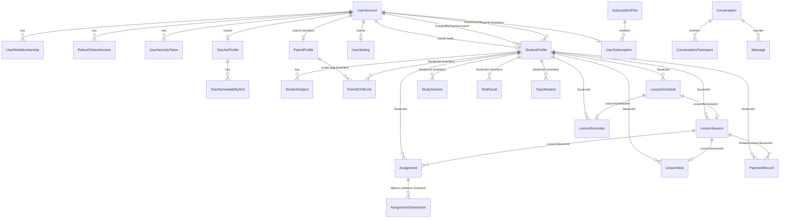

# 🗃️ Veri Modeli ve Modüller Arası İlişkiler (ER Şeması)

> **Kapsam:** Tüm `src/Modules/` domain aggregate root'larının kimlik (Guid) ve modüller arası referans alanları.
> **Yöntem:** Mevcut varlıklar koddan doğrulanmıştır (`<Module>/Domain/<Module>DomainModel.cs`); promp.txt vizyonuyla gelen
> yeni varlıklar **⚠️ Önerilen (henüz kodda yok)** olarak işaretlidir.
> **Güncelleme:** 2026-06-24
>
> İlgili: [`00_genel_bakis.md`](00_genel_bakis.md) · [`mimari_inceleme.md`](mimari_inceleme.md) · [`../INDEX.md`](../INDEX.md)

---

## 1. Modül Sınırı Kuralı (Önemli)

> Her modül **kendi şemasında** ayrı `DbContext` ile yaşar (`identity`, `teachers`, `students`, ...). Aşağıdaki "→" referansları
> **veritabanı FK'sı DEĞİLDİR** — modüller arası doğrudan DB erişimi yasaktır. Bunlar **mantıksal referanslardır**: bir modül
> başka modülün entity `Id`'sini `Guid` olarak saklar; senkronizasyon integration event / application service ile sağlanır
> (bkz. [`mimari_inceleme.md`](mimari_inceleme.md) O5 — read-model mekanizması yeni modüller için önkoşul).

---

## 2. Merkezi Referanslar (Hub'lar)

- **`Identity.UserAccount.Id`** → öğretmen/öğrenci/veli kullanıcılarının kök kimliği. Çoğu modül `*UserId` ile bağlanır.
- **`Students.StudentProfile.Id`** → ders, ödev, ödeme, hatırlatma hep bir öğrenciye iliştirilir.

> ⚠️ **Asimetri:** Öğretmen tarafı `TeacherUserId` (Identity `UserAccount.Id`) ile; öğrenci tarafı `StudentId`
> (`StudentProfile.Id`, Identity değil) ile referanslanır. Yeni modül yazarken dikkat.

---

## 3. ER Diyagramı (Mantıksal — 🟢 mevcut + ⚠️ önerilen)

---

## 4. Aggregate Root'lar — 🟢 Mevcut (Koddan)

> Yalnız kimlik + ilişki alanları; tüm alanlar için ilgili modül doc'una bakın.

| Modül (şema) | Aggregate / Entity | Kimlik | Referanslar | Doc |
|--------------|--------------------|--------|-------------|-----|
| Identity (`identity`) | `UserAccount` | `Id` | — (kök) | [m01](m01_identity.md) |
| | `UserRoleMembership` / `RefreshTokenSession` / `UserSecurityToken` | `Id` | `UserAccountId` → UserAccount | |
| Teachers (`teachers`) | `TeacherProfile` | `Id` | `UserId` → UserAccount | [m02](m02_teachers.md) |
| | `TeacherAvailabilitySlot` | `Id` | `TeacherProfileId` → TeacherProfile | |
| Students (`students`) | `StudentProfile` | `Id` | `UserId?`, `CreatedByTeacherUserId?`, `ParentUserId?` → UserAccount | [m03](m03_students.md) |
| | `StudentSubject` | `Id` | `StudentProfileId` → StudentProfile | |
| Scheduling (`scheduling`) | `LessonSchedule` | `Id` | `TeacherUserId` → UserAccount · `StudentId` → StudentProfile | [m04](m04_scheduling.md) |
| LessonSessions (`lesson_sessions`) | `LessonSession` | `Id` | `LessonScheduleId?` → LessonSchedule · `TeacherUserId` · `StudentId` | [m05](m05_lesson_sessions.md) |
| Assignments (`assignments`) | `Assignment` | `Id` | `StudentId` · `TeacherUserId` · `LessonSessionId?` | [m06](m06_assignments.md) |
| | `LessonNote` | `Id` | `LessonSessionId` · `TeacherUserId` · `StudentId` | |
| Payments (`payments`) | `PaymentRecord` | `Id` | `TeacherUserId` · `StudentId` · `RelatedLessonSessionId?` | [m07](m07_payments.md) |
| Notifications (`notifications`) | `LessonReminder` | `Id` | `LessonScheduleId` (UNIQUE) · `TeacherUserId` · `StudentId` | [m11](m11_notifications.md) |
| Settings (`settings`) | `UserSetting` | `Id` | `UserId` → UserAccount (UNIQUE) | [m15](m15_settings.md) |

**Enum'lar (koddan):** `UserRole`(Admin1,Teacher2,Student3,Parent4) · `UserAccountStatus`(PendingActivation1,Active2,Suspended3,Closed4) · `TeacherLessonFormat`/`ScheduledLessonFormat`(InPerson1,Online2,Hybrid3) · `StudentOrigin`(TeacherManaged1,SelfRegistered2) · `LessonScheduleStatus`(Draft1,Planned2,Cancelled3,Completed4) · `LessonSessionStatus`(Planned1,InProgress2,Completed3,Cancelled4) · `StudentAttendanceStatus`(Unknown1,Attended2,Late3,Absent4) · `AssignmentStatus`(Pending1,InProgress2,Completed3,Cancelled4) · `BillingItemType`(LessonFee1,MonthlyPackage2,ManualAdjustment3) · `PaymentStatus`(Pending1,PartiallyPaid2,Paid3,Overdue4,Cancelled5) · `NotificationChannel`(InApp1,Push2) · `ReminderStatus`(Pending1,Sent2,Cancelled3) · `PrivacyLevel`(Standard1,Limited2,Hidden3) · `SessionTerminationPolicy`(KeepLatest1,TerminateOtherSessions2).

---

## 5. Aggregate Root'lar — ⚠️ Önerilen (henüz kodda yok)

> Detaylar ilgili modül doc'unda. İskelet modüller (Study, Parents, ProgressTracking, Matching, Reviews, Reporting) + yeni modüller (Messaging, Membership, Feedback).

| Modül | Önerilen varlık(lar) | Anahtar alanlar / referanslar | Doc |
|-------|----------------------|-------------------------------|-----|
| M04 Scheduling | `LessonSchedule`+**`MeetingUrl`**; **`ScheduleException`/`Holiday`** | online link; tatil/blackout (`TeacherUserId`) | [m04](m04_scheduling.md) |
| M06 Assignments | **`AssignmentSubmission`**, **`LessonResource`** | `AssignmentId`→Assignment, öğrenci yükleme; kaynak (`TeacherUserId`,`LessonSessionId?`) | [m06](m06_assignments.md) |
| M07 Payments | `PaymentRecord`+**`IsSharedWithParent`** | veli görünürlüğü | [m07](m07_payments.md) |
| M08 Study | **`StudySession`**, **`TestResult`**, **`StudyGoal`**, **`StudyStreak`**, **`Achievement`**/`StudentAchievement`, **`StudyTopic`** | hepsi `StudentId`→StudentProfile | [m08](m08_study.md) |
| M09 Parents | **`ParentProfile`**(`UserId`→UserAccount), **`ParentChildLink`**(`ParentUserId`,`StudentId`, Status) | onaylı bağ, çoklu çocuk | [m09](m09_parents.md) |
| M10 ProgressTracking | **`TopicMastery`**, **`TopicGoal`**, **`ProgressSnapshot`** | `StudentId`→StudentProfile, zaman serisi | [m10](m10_progress_tracking.md) |
| M12 Matching | **`TeacherListing`**, **`StudentRequestListing`**, **`MatchRequest`**, `TeacherSearchProjection` | `TeacherUserId`/`StudentUserId`; konum+yıldız+premium sıralama | [m12](m12_matching.md) |
| M13 Reviews | **`TeacherReview`**, **`ReviewResponse`**, **`ReviewFlag`** | `TeacherUserId`,`StudentId`; doğrulanmış öğrenci | [m13](m13_reviews.md) |
| M16 Messaging | **`Conversation`**, **`ConversationParticipant`**, **`Message`** | yalnız öğretmen↔öğrenci/veli; okundu | [m16](m16_messaging.md) |
| M17 Membership | **`SubscriptionPlan`**, **`UserSubscription`**, **`Campaign`**, **`ReferralCode`**, `AdPlacement` | `UserId`→UserAccount; tier/limit/reklam/kampanya | [m17](m17_membership.md) |
| M18 Feedback | **`FeedbackTicket`**, **`AbuseReport`** | raporlayan `UserId`; hedef (User/Review/Message/Listing) | [m18](m18_feedback.md) |
| Shared (altyapı) | **`IFileStorage`** soyutlaması | yükleme/kaynak/foto için (mimari gap O8) | [mimari_inceleme](mimari_inceleme.md) |

---

## 6. Tam Referans Özeti (FK Haritası — 🟢 mevcut)

**`Identity.UserAccount.Id`'ye:** TeacherProfile.UserId · StudentProfile.{UserId, CreatedByTeacherUserId, ParentUserId} · LessonSchedule.TeacherUserId · LessonSession.TeacherUserId · Assignment.TeacherUserId · LessonNote.TeacherUserId · PaymentRecord.TeacherUserId · LessonReminder.TeacherUserId · UserSetting.UserId

**`Students.StudentProfile.Id`'ye:** LessonSchedule · LessonSession · Assignment · LessonNote · PaymentRecord · LessonReminder (hepsi `.StudentId`)

**`Scheduling.LessonSchedule.Id`'ye:** LessonSession.LessonScheduleId? · LessonReminder.LessonScheduleId (UNIQUE)

**`LessonSessions.LessonSession.Id`'ye:** Assignment.LessonSessionId? · LessonNote.LessonSessionId · PaymentRecord.RelatedLessonSessionId?

---

*Veri Modeli & ER Şeması | Güncelleme: 2026-06-24*
